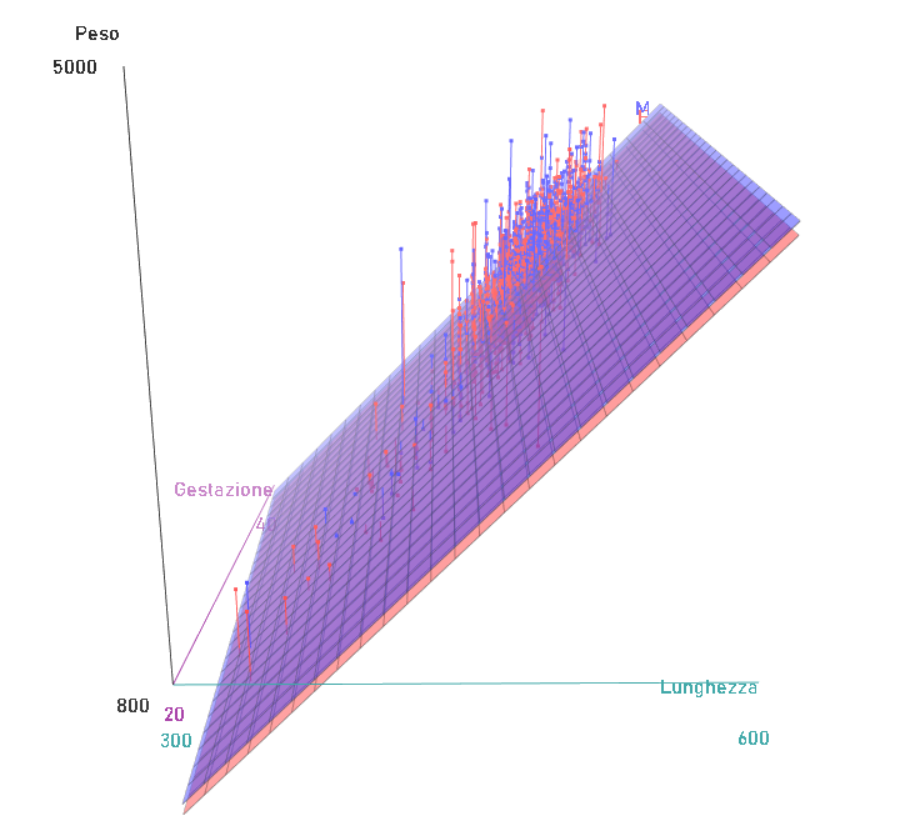
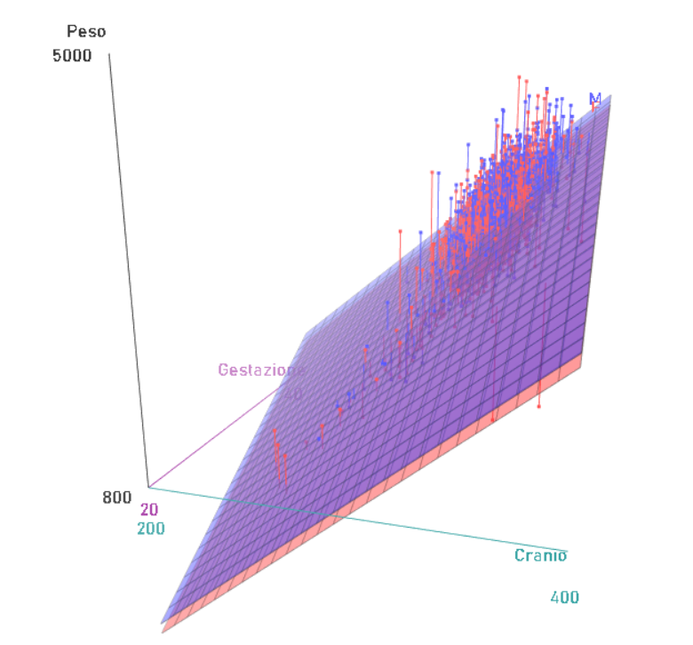
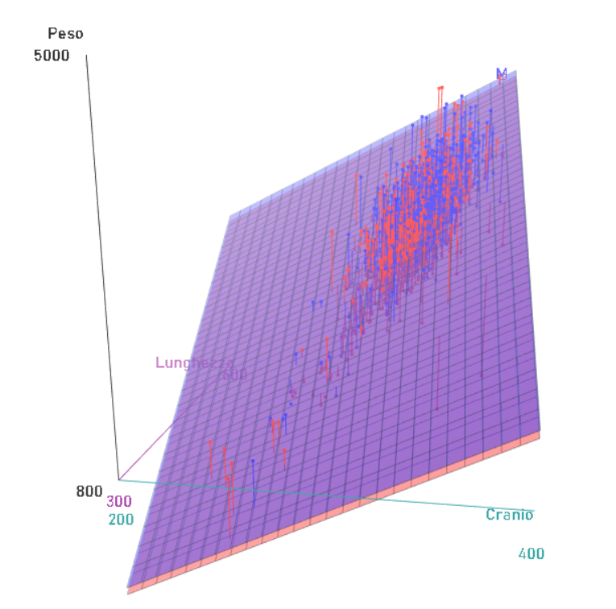

```{r setup, include=FALSE}
knitr::opts_chunk$set(echo = TRUE)
```

## Contesto aziendale

L'azienda **Neonatal Health Solutions** ha come obiettivo quello di creare un modello statistico in grado di prevedere con precisione il peso dei neonati alla nascita, basandosi su variabili cliniche raccolte da tre ospedali. Il progetto mira a migliorare la gestione delle gravidanze ad alto rischio, ottimizzare le risorse ospedaliere e garantire migliori risultati per la salute neonatale.

Il progetto si inserisce all'interno di un contesto di crescente attenzione verso la prevenzione delle complicazioni neonatali. La possibilità di prevedere il peso alla nascita dei neonati rappresenta un'opportunità fondamentale per migliorare la pianificazione clinica e ridurre i rischi associati a nascite problematiche, come parti prematuri o neonati con basso peso.

Di seguito, vengono elencati i principali benefici che questo progetto porterà all’azienda e al settore sanitario:

1.  **Miglioramento delle previsioni cliniche**: Il peso del neonato è un indicatore chiave della sua salute. Avere un modello predittivo accurato consente al personale medico di intervenire tempestivamente in caso di anomalie, riducendo le complicazioni perinatali come le difficoltà respiratorie o l’ipoglicemia.

2.  **Ottimizzazione delle risorse ospedaliere**: Sapere in anticipo quali neonati potrebbero avere bisogno di cure intensive aiuta a organizzare le risorse umane e tecnologiche degli ospedali in modo efficiente. Questo si traduce in una riduzione dei costi operativi e una migliore pianificazione dell’utilizzo delle unità di terapia intensiva neonatale (TIN).

3.  **Prevenzione e identificazione dei fattori di rischio**: Il modello potrà evidenziare i fattori che maggiormente influenzano negativamente il peso del neonato (come il fumo materno, gravidanze multiple o età avanzata della madre). Queste informazioni sono preziose per la prevenzione e la gestione personalizzata delle gravidanze, permettendo interventi proattivi in caso di rischio elevato.

4.  **Valutazione delle pratiche ospedaliere**: Attraverso un’analisi comparativa tra i tre ospedali coinvolti, l’azienda potrà identificare eventuali differenze nei risultati clinici, come una maggiore incidenza di parti cesarei in una determinata struttura. Ciò consente di monitorare la qualità delle pratiche e armonizzare i protocolli tra i diversi centri ospedalieri, migliorando la coerenza delle cure.

5.  **Supporto alla pianificazione strategica**: L’analisi dei dati e le previsioni possono essere utilizzate per prendere decisioni informate non solo a livello clinico ma anche strategico. L'azienda potrà sfruttare queste informazioni per implementare nuove politiche di salute pubblica, garantendo un impatto positivo sui tassi di mortalità e morbilità neonatale.

## PARTE 1: Analisi Preliminare

## 1. Importa il dataset "neonati.csv" e controlla che sia stato letto correttamente dal software

Il dataset *"neonati.csv"* viene importato con la funzione *read.csv* che permette di leggere il file in formato tabella e di creare un dataframe da essa (le variabili costituite da stringhe vengono considerate come fattori avendo specificato *stringAsFactors = T*). Inoltre, una volta creato il dataframe, tramite la funzione *attach* si rende possibile accedere agli oggetti nel dataset semplicemente fornendo i loro nomi.

```{r}
newborns <- read.csv("neonati.csv", 
                     stringsAsFactors = T)
attach(newborns)
n <- nrow(newborns)
n
```

Il file viene letto correttamente dal software e il dataframe generato è costituito da 2500 osservazioni di 10 variabili.

## 2. Descrivi il dataset, la sua composizione, il tipo di variabili e l'obbiettivo dello studio

### 2.1 Descrizione del database

Il dataset in esame è inerente ad uno studio medico in cui si analizzano i dati raccolti da 3 ospedali, riguardanti 2500 neonati. In particolare si sono rilevate le seguenti variabili:

1.  **Anni.madre**: età della madre;

2.  **N.gravidanze**: numero di gravidanze sostenute;

3.  **Fumatrici**: madre fumatrice (0=NO, SI=1);

4.  **Gestazione**: N° di settimane di gestazione;

5.  **Peso**: peso in grammi del neonato;

6.  **Lunghezza**: lunghezza in mm del neonato;

7.  **Cranio**: diametro in mm del cranio del neonato;

8.  **Tipo.parto**: parto naturale o cesareo;

9.  **Ospedale**: ospedale 1, 2, 3;

10. **Sesso**: sesso del neonato M o F.

### 2.2 Tipo di variabili

Le variabili *Anni.madre*, *Gestazione*, *Peso*, *Lunghezza e Cranio* sono **variabili quantitative continue** dato che sono espresse in numeri e possono essere suddivise in sottointervalli sempre più piccoli. La variabile *N.gravidanze* è invece una **variabile quantitativa discreta** poiché assume valori interi e rappresenta un conteggio. Infine, le variabili *Fumatrici*, *Tipo.parto*, *Ospedale* e *Sesso* sono delle **variabili qualitative su scala nonimale** poichè sono espresse in lettere (tranne *Fumatrici* che è una variabile *dummy*) e le loro modalità si possono confrontare solo in termini di uguaglianza. Inoltre, con la funzione *class* è possibile visualizzare la **tipologia delle variabili di R** presenti nel dataframe generato. Prima di farlo è conveniente, però, trasformare in fattore anche la variabile *Fumatrici*.

```{r}
newborns$Fumatrici <- factor(newborns$Fumatrici)

data_type <- sapply(newborns, class)
data_type
```

Si può notare come anche le variabili quantitative continue, così come la variabile quantitativa discreta *N.gravidanze*, sono di tipo **"integer"**, ossia sono numeri interi. Questo è dovuto al fatto che nel dataset in questione le variabili continue assumono solo valori interi. Le restanti variabili sono invece di tipo **"factor"**, ossia fattori, essendo state trasformate durante l'importazione del dataset in modo da essere trattate correttamente come variabili qualitative (oltre alla variabilie *Fumatrici* trasformata poco fa).

### 2.3 Obiettivo dello studio

L'obiettivo dello studio è scoprire se è possibile prevedere il peso del neonato alla nascita date tutte le altre variabili. In particolare, si vuole studiare una relazione con le variabili della madre, per capire se queste hanno o meno un effetto significativo, come ad esempio l'effetto potenzialmente dannoso del fumo (nascite premature?). Si usano anche lunghezza e diametro del cranio del neonato perché si possono stimare già dalle ecografie, ma in generale potrebbero anche fungere da variabili di controllo.

## 3. Indaga le variabili effettuando una breve analisi descrittiva, utilizzando indici e strumenti grafici che conosci

Di seguito viene effettuata una breve **analisi descrittiva** per indagare le variabili presenti nel dataset.

### 3.1 Indici di posizione

#### *3.1.1 Distribuzione di frequenze assolute e Moda*

Vengono ricavate con la funzione *table* la **distribuzione di frequenze assolute** e la **moda** delle variabili *Anni.madre*, *N.gravidanze*, *Fumatrici*, *Gestazione*, *Tipo.parto*, *Ospedale* e *Sesso*.

```{r}
abs_freq <- sapply(newborns[, c(1:4,8:10)], table)
abs_freq
```

Osservando le frequenze ottenute con la funzione *table* si può notare la presenza di due valori anomali nella variabile *Anni.madre*. Sono presenti, infatti, un valore pari a 0, ed un valore pari a 1, che non possono in alcun modo rappresentare l'età di una madre. Per questo motivo, non avendo altre informazioni in merito a questi valori anomali (eventuali errori di trascrizione ad esempio), si opta per l'eliminazione delle due righe del dataset in cui sono presenti per non falsare i risultati delle analisi.

```{r}
newborns <- newborns[!(Anni.madre == 0 | Anni.madre == 1), ]
rownames(newborns) <- NULL
attach(newborns)
n <- nrow(newborns)
n
```

In questo modo le osservazioni da studiare per ogni variabile non sono più 2500 bensì 2498. A questo punto si possono ricavare i **valori modali** osservando le distribuzioni di frequenze:

-   *Anni.madre*: 30 anni (8 %);

-   *N.gravidanze*: 0 gravidanze (43.9 %);

-   *Fumatrici*: circa il 96 % delle donne presenti nel campione non sono fumatrici (moda: variabile dummy 0);

-   *Gestazione*: 40 settimane (29.7 %);

-   *Tipo parto*: il 70.8 % delle donne presenti nel campione hanno avuto un parto naturale;

-   *Ospedale*: il valore modale in questo caso è rappresentato dall'ospedale 2 ma non è informativo poichè i dati del campione provengono quasi in maniera equa dai tre ospedali;

-   *Sesso*: anche in questo caso la moda non è informativa poichè i neonati di sesso femminile e maschile sono presenti quasi in egual misura nel campione.

#### *3.1.2 Summary: minimo, massimo, media, mediana e quantili*

Si possono ottenere i valori degli indici di posizione **minimo**, **massimo**, **media aritmetica**, **mediana** e **quartili** delle variabili quantitative del dataset utilizzando la funzione *summary*.

```{r}
summary <- summary(newborns[, c(1,2,4:7)])
summary
```

Si può ad esempio evidenziare come la variabile risposta *Peso* va da un minimo di 830 g ad un massimo di 4930 g ed ha un valore medio di 2384 g e mediano di 3300 g. Il primo e il terzo quartile, invece, sono rispettivamente pari a 2990 g e 3620 g.

### 3.2 Indici di variabilità

#### *3.2.1 Range e range interquartile*

Il **range** delle variabili quantitative può essere ricavato attraverso la funzione *range* mentre il **range interquartile** tramite la funzione *IQR*.

```{r}
range <- sapply(newborns[, c(1,2,4:7)], range)
range
IQR <- sapply(newborns[, c(1,2,4:7)], IQR)
IQR
```

Il peso dei neonati ha un range, o intervallo di variazione, pari a 4100 g e un range interquartile pari a 630 g.

#### *3.2.2 Deviazione standard e coefficiente di variazione*

La **deviazione standard σ** fornisce un indice di variabilità nella stessa unità di misura dei dati osservati e può essere calcolata in R tramite la funzione *sd*. Il **coefficiente di variazione CV** invece, utile a confrontare le variabilità di diverse variabili, può essere calcolato solo tramite un’apposita funzione.

```{r}
sigma <- sapply(newborns[, c(1,2,4:7)], sd)
sigma

CV_func <- function(variable){
  return( sd(variable)/mean(variable) * 100 )}

CV <- sapply(newborns[, c(1,2,4:7)], CV_func)
CV
```

La variabile risposta *Peso* ha una deviazione standard di circa 525.23 g che è pari a circa il 16 % della sua media. La variabile con la variabilità più elevata è invece *N.gravidanze* che ha una deviazione standard pari a circa il 130.50 % della sua media.

### 3.3 Indici di forma

#### *3.3.1 Indice di asimmetria di Fisher e coefficiente di curtosi*

Per calcolare l’**indice di asimmetria di Fisher γ~1~** e il **coefficiente di curtosi γ~2~** si può utilizzare la libreria *moments* e rispettivamente le funzioni *skeweness* e *kurtosis*. Per ottenere il coefficiente di curtosi bisogna sottrarre tre al valore ottenuto con la funzione kurtosis per centrarlo in zero.

```{r}
library(moments)

gamma1 <- skewness(newborns[, c(1,2,4:7)])
gamma1

gamma2 <- kurtosis(newborns[, c(1,2,4:7)]) - 3
gamma2

```

Osservando gli indici di Fisher ottenuti si può dedurre come tutte le variabili abbiano una *distribuzione asimmetrica negativa* (γ~1~ \< 0) tranne *Anni.madre* e *N.gravidanze* che hanno una *distribuzione asimmetrica positiva* (γ~1~ \> 0). Osservando i coefficienti di curtosi ottenuti si può dedurre come tutte le variabili abbiano una *distribuzione leptocurtica* (γ~2~ \> 0) tranne *Anni.madre* che ha una *distribuzione platicurtica* (γ~2~ \< 0).

### 3.4 Grafici

#### *3.4.1 Boxplot e densità di probabilità delle variabili: Peso, Lunghezza e Cranio*

Per rappresentare in un unico diagramma gli indici di posizione e la variabilità di una serie di dati è possibile utilizzare i boxplot. Inoltre, se si vuole visualizzare sia il **boxplot** che la **densità di probabilità** di una variabile, in R è possibile utilizzare la libreria *gghalves* con le geometrie *geom_half_boxplot* e *geom_half_violin*. Si può ad esempio usare questo tipo di grafico per analizzare la variabile risposta *Peso*.

```{r}
suppressWarnings(library(gghalves))

ggplot(newborns) +
  geom_half_violin(mapping = aes(
    y = Peso),
    side = "l",
    fill = "cadetblue1") +
  geom_half_boxplot(mapping = aes(
    y = Peso), 
    side = "r",
    fill = "cadetblue3") +
  labs(title = "Boxplot e densità di probabilità del peso dei neonati",
       y = "Peso del neonato in g") +
  scale_x_discrete() +
  theme_bw() +
  theme(plot.title = element_text(hjust = 0.5))
```

In questo modo, con il precedente grafico, è possibile visualizzare gli indici di posizione e di variabilità già calcolati numericamente (con in più gli outliers) oltre alla densità di probabilità ipotizzata con gli indici di forma (distribuzione leggermente asimmetrica negativa e platicurtica).

Lo stesso tipo di grafico può essere ottenuto anche per la *lunghezza del neonato* e il *diametro del cranio*. Infatti, queste due variabili sono intuitivamente quelle che possono condizionare maggiormente il peso.

```{r}
ggplot(newborns) +
  geom_half_violin(mapping = aes(
    y = Lunghezza),
    side = "l",
    fill = "darkseagreen1") +
  geom_half_boxplot(mapping = aes(
    y = Lunghezza), 
    side = "r",
    fill = "darkseagreen3") +
  labs(title = "Boxplot e densità di probabilità della lunghezza dei neonati",
       y = "Lunghezza del neonato in mm") +
  scale_x_discrete() +
  theme_bw() +
  theme(plot.title = element_text(hjust = 0.5))
```

```{r}
ggplot(newborns) +
  geom_half_violin(mapping = aes(
    y = Cranio),
    side = "l",
    fill = "peachpuff") +
  geom_half_boxplot(mapping = aes(
    y = Cranio), 
    side = "r",
    fill = "peachpuff3") +
  labs(title = "Boxplot e densità di probabilità del diametro del cranio dei neonati",
       y = "Diametro del cranio del neonato in mm") +
  scale_x_discrete() +
  theme_bw() +
  theme(plot.title = element_text(hjust = 0.5))
```

Osservando i precedenti grafici si può notare che anche la lunghezza e il diametro del cranio dei neonati, così come il peso, hanno una distribuzione delle osservazioni con un'ampia coda sinistra.

## 4. Saggia l'ipotesi che la media del peso e della lunghezza di questo campione di neonati siano significativamente uguali a quelle della popolazione

Per saggiare l'ipotesi che la media del peso e della lunghezza di questo campione di neonati siano significativamente uguali a quelle della popolazione si possono prendere come valori medi della popolazione **3300 g** per il peso e **500 mm** per la lunghezza.

Si può pensare di utilizzare un **t-test (test t di Student)** **a campione singolo** per saggiare le precedenti ipotesi, tuttavia, ci sone delle assunzioni da rispettare prima di poterlo effettuare:

-   la variabile deve essere quantitativa;

-   i dati devono riferirsi ad un campione casuale della popolazione;

-   le osservazioni del campione devono essere indipendenti tra di loro;

-   le osservazioni del campione devono avere una distribuzione normale.

Sia il peso che la lunghezza dei neonati sono variabili quantitative e le loro osservazioni, provenienti da un campione casuale della popolazione, sono indipendenti tra di loro. Invece, per verificare la normalità della distribuzione delle osservazioni delle due variabili si può eseguire il test di normalità di Shapiro.

### 4.1 Test di normalità di Shapiro-Wilk per il peso e la lunghezza

Per effettuare il **test di normalità di Shapiro-Wilk** in R è possibile utilizzare la funzione *shapiro.test* inserendo come argomento la variabile considerata.

```{r}
shapiro_weight <- shapiro.test(Peso)
shapiro_weight

shapiro_length <- shapiro.test(Lunghezza)
shapiro_length
```

L'ipotesi nulla di normalità H~0~ dello shapiro test viene rifiutata sia per il peso che per la lunghezza poichè si ottiene per entrambi un *p-value* vicino allo 0. Questo risultato poteva essere ipotizzato già dall'esito della precedente analisi descrittiva in cui le variabili *Peso* e *Lunghezza* sono risultate essere asimmetriche.

Dunque l'assunzione di normalità non viene rispettata, tuttavia, nel caso di **campioni di dimensioni sufficientemente grandi** come in questo caso (*2498 osservazioni*), il *teorema del limite centrale* permette di utilizzare ugualmente il t-test.

Per queste motivazioni si procede di seguito nell'eseguire il t-test per il peso e per la lunghezza dei neonati.

### 4.2 t-test per confrontare la media del peso dei neonati nel campione con la media del peso dei neonati della popolazione

Per effettuare un **t-test** in R è possibile utilizzare la funzione *t.test* specificando come argomenti: la variabile considerata, il parametro di riferimento *mu*, il livello di confidenza *conf.level* ed il tipo di test (unilaterale o bilaterale) col parametro *alternative*.

Il **t-test per confrontare la media del peso dei neonati nel campione con la media del peso dei neonati della popolazione** viene eseguito, dunque, specificando la variabile *Peso*, la media della popolazione di 3300, un livello di confidenza di 0.95 (corrispondente ad un livello di significatività α del 5%) e un tipo di test bilaterale (*"two.sided"*).

```{r}
t_test_weight <- t.test(Peso,
                        mu = 3300,
                        conf.level = 0.95, 
                        alternative = "two.sided")
t_test_weight
```

Dal risultato del t-test emerge che l'ipotesi nulla di uguaglianza tra le medie H~0~ non viene rifutata. Infatti, la media del peso dei neonati nel campione, pari a 3284.18 g, **non è significativamente diversa** dalla media del peso dei neonati della popolazione, pari a 3300 g, poichè il *p-value* è di circa 0.13 ed è quindi maggiore del *livello di significatività* fissato a 0.05. Analogamente si può osservare come la media del peso dei neonati della popolazione ricada all'interno dell'*intervallo di confidenza* che va da 3263.58 g a 3304.79 g.

E' possibile osservare anche graficamente l'esito del t-test rappresentando la *statistica test* (*t = -1.505*) sul grafico generato da una distribuzione t di Student con 2497 gradi di libertà (n - 1).

```{r}
plot(density(rt(100000, 2497)), main = "t-test sulla media del peso dei neonati nel campione")
abline(v = qt(0.025, 2497), col = 2)
abline(v = qt(0.975, 2497), col = 2)
points(x = -1.505, y=0, pch = 20, col = 4, cex = 3)
```

Si osserva come la statistica test, data dal pallino azzuro, ricada nella *zona di accettazione dell'ipotesi nulla* all'interno dei due segmenti in rosso che rappresentano i quantili al 2.5 % e 97.5 % della distribuzione.

### 4.3 t-test per confrontare la media della lunghezza dei neonati nel campione con la media della lunghezza dei neonati della popolazione

Analogamente a quanto visto per il peso, viene effettuato il **t-test per confrontare la media della lunghezza dei neonati nel campione con la media della lunghezza dei neonati della popolazione**.

```{r}
t_test_length <- t.test(Lunghezza, 
                        mu = 500,
                        conf.level = 0.95, 
                        alternative = "two.sided")
t_test_length
```

Dal risultato del t-test questa volta si evince che l'ipotesi nulla di uguaglianza tra le medie H~0~ viene rifutata. Infatti, la media della lunghezza dei neonati nel campione, pari a circa 494.70 mm, è **significativamente diversa** dalla media della lunghezza dei neonati della popolazione di 500 mm poichè il *p-value* è vicino allo 0 ed è quindi minore del *livello di significatività* fissato a 0.05. Analogamente si può osservare come la media della lunghezza dei neonati della popolazione non ricada all'interno dell'*intervallo di confidenza* che va da 493.66 mm a 495.73 mm.

E' possibile osservare anche graficamente l'esito del t-test rappresentando la *statistica test* (*t = -10.069*) sul grafico generato dalla distribuzione t di Student con 2497 gradi di libertà (n - 1).

```{r}
plot(density(rt(100000,2497)), xlim=c(-11,4), main = "t-test sulla media della lunghezza dei neonati nel campione")
abline(v=qt(0.025,2497),col=2)
abline(v=qt(0.975,2497),col=2)
points(x=-10.084,y=0,pch=20,col=4,cex=3)
```

Si osserva come la statistica test, data dal pallino azzuro, ricada abbondantemente nella *zona di rifuto dell'ipotesi nulla* al di fuori dei due segmenti in rosso che rappresentano i quantili al 2.5 % e 97.5 % della distribuzione.

## 5. Per le stesse variabili, o per altre per le quali ha senso farlo, verifica differenze significative tra i due sessi

Si sceglie di verificare eventuali differenze significative tra i due sessi sempre per le variabili *Peso* e *Lunghezza*. Prima di effettuare dei test statistici però, è utile analizzare graficamente le variabili in questione in relazione al sesso.

### 5.1 Boxplot e densità di probabilità del peso dei neonati in relazione al sesso

Innanzitutto è possibile osservare, sempre utilizzando *gghalves*, **i boxplot e le densità di probabilità del peso dei neonati in relazione al sesso**.

```{r}
ggplot(newborns) +
geom_half_violin(mapping = aes(
  x = Sesso,
  y = Peso,
  fill = Sesso),
  side = "l") +
geom_half_boxplot(mapping = aes(
  x = Sesso,
  y = Peso,
  fill = Sesso), 
  side = "r") +
labs(title = "Boxplot e densità di probabilità del peso dei neonati per sesso",
     x = "Sesso",
     y = "Peso dei neonati in g") +
scale_fill_manual(values = c("lightpink", "lightblue")) +
scale_x_discrete(labels = c("F" = "Femmina", "M" = "Maschio")) +
theme_bw() +
theme(plot.title = element_text(hjust = 0.5))
```

Risulta evidente dal grafico come il peso dei neonati maschi (boxplot celeste) sia mediamente superiore al peso delle femmine (boxplot rosa). Le densità di probabilità sono, invece, simili: entrambe le distribuzioni sono asimmetriche negative con un'ampia coda sinistra.

### 5.2 Boxplot e densità di probabilità della lunghezza dei neonati in relazione al sesso

Così come per il peso, è possibile costruire anche **i boxplot e le densità di probabilità della lunghezza dei neonati in relazione al sesso** per osservare graficamente le differenze.

```{r}
ggplot(newborns) +
geom_half_violin(mapping = aes(
  x = Sesso,
  y = Lunghezza,
  fill = Sesso),
  side = "l") +
geom_half_boxplot(mapping = aes(
  x = Sesso,
  y = Lunghezza,
  fill = Sesso), 
  side = "r") +
labs(title = "Boxplot e densità di probabilità della lunghezza dei neonati per sesso",
     x = "Sesso",
     y = "Lunghezza dei neonati in mm") +
scale_fill_manual(values = c("lightpink", "lightblue")) +
scale_x_discrete(labels = c("F" = "Femmina", "M" = "Maschio")) +
theme_bw() +
theme(plot.title = element_text(hjust = 0.5))
```

Si evince dal grafico, anche in questo caso, come la lunghezza dei neonati maschi (boxplot celeste) sia mediamente superiore alla lunghezza delle femmine (boxplot rosa) mentre le densità di probabilità sono invece simili: entrambe le distribuzioni sono asimmetriche negative con un'ampia coda sinistra.

### 5.3 Test di omogeneità tra varianze di Levene e test di normalità di Shapiro-Wilk per il peso e la lunghezza suddivisi per sesso

In questo caso, per confrontare le medie tra il peso dei neonati di sesso maschile e di sesso femminile, così come per la lunghezza, si può pensare di utilizzare un **t-test per differenze tra medie di campioni indipendenti**. Tuttavia, oltre alle assunzioni viste per il t-test a singolo campione (tutte rispettate tranne per la normalità), bisogna anche rispettare le seguenti ulteriori assunzioni:

-   le osservazione dei gruppi devono essere l'una indipendente dall'altra;

-   le varianze tra i gruppi devono essere almeno simili (omogeneità tra le varianze).

Per quanto riguarda la prima assunzione, sia per il peso che per la lunghezza si può affermare che le osservazioni sui neonati di sesso maschile non sono correlate in alcun modo alle osservazioni sui neonati di sesso femminile. Per verificare la seconda assunzione, invece, è possibile utilizzare il **test di omogeneità tra varianze non parametrico di Levene** che risulta essere adatto in presenza di variabili non normali come in questa situazione. Di seguito viene effettuato il test di Levene utilizzando la funzione *leveneTest* della libreria *car*. Viene eseguito nuovamente anche uno **shapiro test** per confermare che le variabili *Peso* e *Lunghezza* non abbiano una distribuzione normale anche suddividendole nei due gruppi "maschio" e "femmina".

```{r}
shapiro_weight_M <- shapiro.test(Peso[Sesso == "M"])
shapiro_weight_M
shapiro_weight_F <- shapiro.test(Peso[Sesso == "F"])
shapiro_weight_F

shapiro_length_M <- shapiro.test(Lunghezza[Sesso == "M"])
shapiro_length_M
shapiro_length_F <- shapiro.test(Lunghezza[Sesso == "F"])
shapiro_length_F

suppressWarnings(library(car)) 

levene_weight_sex <- leveneTest(Peso ~ Sesso)
levene_weight_sex

levene_length_sex <- leveneTest(Lunghezza ~ Sesso)
levene_length_sex
```

Dai risultati dello shapiro test si conferma la non normalità del peso e della lunghezza dei neonati anche suddivisi per sesso essendo i *p-value* vicini allo 0. Dal test di Levene si evince, invece, che le varianze del peso dei neonati di sesso maschile e femminile sono omogenee tra di loro (*p-value* di 0.36) mentre nel caso della lunghezza le varianze non sono omogenee tra di loro (*p-value* di 0.0012 minore del 5 %).

In sintesi, la normalità non è mai rispettata, mentre l'omogeneità tra le varianze tra i gruppi maschio/femmina è rispettata soltanto per il peso. Nonostante ciò, sempre grazie all'elevato numero di osservazioni e al teorema del limite centrale, si potrebbe utilizzare un **t-test standard** per il peso e un **t-test di Welch** (non è necessaria l'omogeneità tra varianze) per la lunghezza. Quando non vengono rispettate le assunzioni di normalità e omogeneità tra varianze del t-test può, però, risultare più robusto l'utilizzo di un **test non parametrico** che non necessita delle precedenti assunzioni. Di seguito dunque, si sceglie di utilizzare il **test di Wilcoxon-Mann-Withney** (non parametrico) sia per il peso che per la lunghezza**.**

### 5.4 Wilcoxon-Mann-Withney test per il peso suddiviso per sesso

Per effettuare il **test di Wilcoxon-Mann-Withney** con lo scopo di **verificare differenze significative tra la media del peso dei neonati di sesso maschile e la media del peso dei neonati di sesso femminile** è possibile utilizzare la funzione *wilcox.test* specificando come argomenti: la variabile *Peso* in relazione alla variabile *Sesso* (*Peso \~ Sesso*), un livello di confidenza pari a 0.95*,* un tipo di test bilaterale (*"two.sided"*) e infine l'argomento *paired* impostato su *False* per indicare che si sta effettuando un test su gruppi indipendenti e non appaiati.

```{r}
mu_weight_M <- mean(Peso[Sesso == "M"])
mu_weight_M
mu_weight_F <- mean(Peso[Sesso == "F"])
mu_weight_F

wilcox_test_weight <- wilcox.test(Peso ~ Sesso,
                                  conf.level = 0.95,
                                  alternative = "two.sided",
                                  paired = F)
wilcox_test_weight
```

Dal risultato del test di Wilcoxon si evince che l'ipotesi nulla di uguaglianza tra le medie H~0~ viene rifutata. Infatti, la media del peso dei neonati di sesso maschile, pari a circa 3408.50 g, è **significativamente diversa** dalla media del peso dei neonati di sesso femminile, pari a circa 3161.06 g*,* poichè il *p-value* è vicino allo zero ed è quindi minore del *livello di significatività* fissato a 0.05.

### 5.5 Wilcoxon-Mann-Withney test per la lunghezza suddivisa per sesso

Analogamente a quanto visto per il peso, viene effettuato il **test di Wilcoxon per confrontare la media della lunghezza dei neonati di sesso maschile con la media della lunghezza dei neonati di sesso femminile**.

```{r}
mu_lenght_M <- mean(Lunghezza[Sesso == "M"])
mu_lenght_M
mu_lenght_F <- mean(Lunghezza[Sesso == "F"])
mu_lenght_F

wilcox_test_length <- wilcox.test(Lunghezza ~ Sesso,
                                  conf.level = 0.95,
                                  alternative = "two.sided",
                                  paired = F)
wilcox_test_length
```

Dal risultato del test di Wilcoxon si evince anche in questo caso che l'ipotesi nulla di uguaglianza tra le medie H~0~ viene rifutata. Infatti, la media della lunghezza dei neonati di sesso maschile, pari a circa 499.68 mm, è **significativamente diversa** dalla media della lunghezza dei neonati di sesso femminile, pari a circa 489.76 g*,* poichè il *p-value* è vicino allo 0 ed è quindi minore del *livello di significatività* fissato a 0.05.

## 6. Si vocifera che in alcuni ospedali si facciano più parti cesarei, sai verificare questa ipotesi?

Per verificare l'ipotesi che in alcuni ospedali si facciano più parti cesarei, prima di procedere ad effettuare un test statistico, è utile raggruppare i dati per ospedale utilizzando la libreria *dplyr* e creare una tabella con le seguenti statistiche:

-   numero di parti cesarei per ciascun ospedale;

-   numero di parti naturali per ciascun ospedale;

-   numero totale di osservazioni per ospedale;

-   percentuale di parti cesarei per ciascun ospedale.

```{r}
suppressMessages(library(dplyr))

count_ces_by_hosp <- newborns %>%
  group_by(Ospedale) %>%
  summarise(
    count_ces = sum(ifelse(Tipo.parto == "Ces", 1, 0)),
    count_nat = sum(ifelse(Tipo.parto == "Nat", 1, 0)),
    count_tot = sum(ifelse(Tipo.parto %in% c("Ces", "Nat"), 1, 0)),
    perc_ces = round((count_ces / count_tot) * 100, 2))
    
count_ces_by_hosp
```

Dalla tabella ottenuta si evince che nell'*ospedale 1* si ha il 29.66 % di parti cesarei, nell'*ospedale 2* il 29.95 % e nell'*ospedale 3* il 27.82 %.

Inoltre, è possibile anche vedere graficamente le differenze in percentuale tra i tipi di parto nei tre ospedali tramite un **grafico a barre normalizzato** realizzato con la funzione *geom_bar* di *ggplot2*.

```{r}
ggplot(newborns) +
  geom_bar(aes(
    x = Ospedale,
    y = after_stat(count / sum(count)),  
    fill = Tipo.parto),
    position = "fill",
    col = "black") +
  labs(title = "Grafico a barre normalizzato sul tipo di parto per ogni ospedale",
       x = "Ospedale",
       y = "Tipo di parto effettuato in %",
       fill = "Tipo di parto") +
  scale_y_continuous(labels = scales::percent_format()) +  
  theme_bw() +
  theme(plot.title = element_text(hjust = 0.5),
        legend.position = "bottom")
```

Dunque sia dalla tabella realizzata con *dplyr*, che dal grafico a barre normalizzato precedente, si evidenzia che nei primi due ospedali (*ospedale 1* e *ospedale 2*) vengono effettuati più parti cesarei rispetto all'*ospedale 3.* Tuttavia, per verificare se questa differenza è significativa è necessario effettuare un test statistico e in questo caso il test più adatto è il test Chi-quadrato di Pearson.

### 6.1 Test Chi-quadrato di Pearson per l'indipendenza tra ospedale e tipo di parto

Il **test Chi-quadrato di Pearson** è un test non parametrico che viene utilizzato nelle tabelle di contingenza per saggiare l'ipotesi di indipendenza tra variabili qualitative o quantitative in classi o quantitative discrete. Risulta perciò ideale per saggiare l'ipotesi di indipendenza tra le due variabili qualitative *Ospedale* e *Tipo.parto*.

Prima di poter effettuare il test Chi-quadrato, però, è necessario ottenere una **tabella di contingenza** tra le due variabili in esame creando, con la funzione *matrix,* una matrice che ha come elementi il numero di parti cesarei e naturali ottenuti in precedenza con *dplyr*.

```{r}
contingency_table <- matrix(data = c(242, 574,
                                     254, 594,
                                     232, 602),
                            nrow = 3,
                            ncol = 2,
                            byrow = T)

colnames(contingency_table) <- c("Cesareo","Naturale")
row.names(contingency_table) <- c("Ospedale 1","Ospedale 2","Ospedale 3")

contingency_table
```

Una volta ottenuta la tabella di contingenza relativa alle variabili *Ospedale* e *Tipo.parto* è possibile assegnarla come argomento alla funzione *chisq.test* di R che permette di eseguire il test Chi-quadrato.

```{r}
chisq_test_type_birth <- chisq.test(contingency_table)
chisq_test_type_birth
```

Dal risultato del test Chi-quadrato si evince che il tipo di parto effettuato è **indipendente** dall'ospedale in cui vengono prelevate le osservazioni essendo il *p-value* pari a circa 0.58. Dunque, l'ipotesi che in alcuni ospedali vengano effettuati più parti cesarei rispetto ad altri viene rifiutata.

## PARTE 2: Analisi Multidimensionale

## 1. Ricordati qual è l’obbiettivo dello studio e indaga le relazioni a due a due, soprattutto con la variabile risposta

L'obiettivo dello studio è scoprire se è possibile **prevedere il peso del neonato alla nascita date tutte le altre variabili**. Dunque, la **variabile risposta** è il **peso del neonato in grammi (*Peso*)**. Dall'analisi descrittiva effettuata in precedenza è risultato che la variabile *Peso*:

-   è leggermente asimmetrica negativa: γ~1~ = - 0.65;

-   ha una distribuzione leptocurtica: γ~2~ = 2.03;

-   ha una distribuzione non normale: *p-valu*e dello *shapiro test* vicino allo 0.

La variabile *Peso*, dunque, non ha delle osservazioni che seguono una distribuzione normale e questo allontanamento dalla normalità si ripercuoterà anche sui residui.

### 1.1 Matrice di correlazione (coefficiente di correlazione lineare tra le variabili a due a due)

Per indagare le relazioni tra le variabili a due a due, con particolare attenzione alla variabile risposta, è possibile calcolare la **matrice di correlazione** costituita dai **coefficienti di correlazione lineare di Bravais-Pearson ρ~xy~** ( *ρ~xy~ = σ~xy~ / σ~x~ σ~y~* ). Tale coefficiente varia da -1 ad 1 dove:

-   ρ~xy~ = 1 indica *perfetta correlazione positiva;*

-   ρ~xy~ = -1 indica *perfetta correlazione negativa;*

-   ρ~xy~ = 0 indica *assenza di correlazione*.

Per calcolare la matrice di correlazione in R è possibile utilizzare la funzione *cor* specificando come argomento le variabili del dataset valide: tutte le variabili quantitative.

```{r}
correlation_matrix <- round(cor(newborns[, c(1,2,4:7)]), 2)
correlation_matrix
```

È anche possibile ottenere una matrice di correlazione (ricordandosi che è simmetrica) costituita per metà dai valori numerici dati dal coefficiente di correlazione, e per metà dagli scatterplot delle variabili confrontate a due a due, attraverso la funzione *pairs*. Questo tipo di visualizzazione permette una migliore analisi delle relazioni tra le variabili aggiungendo la componente grafica.

```{r}
panel.cor <- function(x, y, digits = 2, prefix = "", cex.cor, ...)
{
  usr <- par("usr")
  par(usr = c(0, 1, 0, 1))
  r <- cor(x, y)
  txt <- format(c(r, 1), digits = digits)[1]
  txt <- paste0(prefix, txt)
  if (missing(cex.cor)) cex.cor <- 0.8 / strwidth(txt)
  text(0.5, 0.5, txt, cex = 1.5)
}

pairs(newborns[, c(1,2,4:7)],lower.panel=panel.cor, upper.panel=panel.smooth)
```

Dunque, dalla precedente matrice di correlazione si può osservare come la variabile che è maggiormente correlata con la variabile risposta *Peso* è la *lunghezza del neonato* che ha un coefficiente di correlazione di 0.80 che indica una forte correlazione positiva. A seguire vi sono il *diametro del cranio del neonato* che ha un coefficienti di correlazione pari 0.70 e il *numero di settimane di gestazione* con un coefficiente di correlazione di 0.59. Gli *anni della madre* e il *numero di gravidanze* invece, avendo dei coefficienti di correlazione rispettivamente di -0.02 e 0.00, risultano non avere nessun tipo di correlazione con il peso dei neonato.

Anche dagli scatterplot si possono trarre delle conclussioni importanti. Si osserva, infatti, come la nuvola di punti formata dalla lunghezza dei neonati in relazione al peso tenda a formare una retta con inclinazione positiva: all'aumentare della lunghezza dei neonati aumenta linearmente il peso. Allo stesso modo i valori del diametro del cranio in relazione ai valori del peso tendono a formare una retta, questa volta con una pendenza leggermente minore essendoci meno correlazione e con un possibile leggero andamento non lineare. Anche per quanto riguarda lo scatterplot che mette in relazione il numero di settimane di gestazione con il peso, si può notare un possibile andamento non lineare: la nuvola di punti sembra tendere ad una retta inizalmente ma comincia a curvare e ad appiattirsi all'aumentare del numero di settimane. Infine, gli scatterplot relativi agli anni della madre e al numero di gravidanze confrontati con il peso sono costituiti da nuvole di punti sparsi che non seguono nessuna direzione. Anche se, per il numero di gravidanze, sembrerebbe poterci essere un pattern non lineare ma questo è probabilmente dovuta alla minor presenza di donne con molte gravidanze.

Dopo aver indagato le relazioni con la variabile risposta *Peso,* è importante tenere in considerazione anche le relazioni tra le altre variabili a due a due, questo perchè bisogna evitare problemi di *multicollinearità* per avere un buon modello di regressione lineare multipla. Dalla matrice di correlazione si evince che le variabili che hanno la correlazione più elevata tra di loro e potrebbero creare eventuali problemi sono *Lunghezza* con *Gestazione (ρ~xy~ = 0.62)* e *Lunghezza* con *Cranio (ρ~xy~ = 0.60).*

### 1.2 Boxplot e test statistici sul peso in relazione alle variabili qualitative

Il coefficiente di correlazione lineare di Pearson può essere utilizzato soltanto per le variabili quantitative, per questo motivo per confrontare le restanti variabili qualitative con la variabile risposta *Peso* bisogna utilizzare altri strumenti come i boxplot. Di seguito, dunque, vengono costruiti i **boxplot** ed eseguiti i **test statistici** sul peso in relazione alle seguenti variabili:

-   *Sesso* (il peso in relazione al sesso è stato già analizzato in precedenza ma vengono riportati rapidamenre i risultati per completezza);

-   *Fumatrici*;

-   *Tipo.parto*.

#### *1.2.1 Peso in relazione al sesso*

Come già analizzato in precedenza, il peso dei neonati maschi è mediamente superiore al peso delle femmine. Infatti, la media del peso dei neonati di sesso maschile, pari a circa 3408.50 g, è **significativamente diversa** dalla media del peso dei neonati di sesso femminile, pari a circa 3161.06 g*.* Di seguito si riportano i **boxplot del peso in relazione al sesso** e i risultati del **test di Wilcoxon-Mann-Withney.**

```{r}
ggplot(newborns) +
geom_boxplot(aes(
  x = Sesso,
  y = Peso,
  fill = Sesso)) +
labs(title = "Boxplot del peso dei neonati per sesso",
     x = "Sesso",
     y = "Peso dei neonati in g") +
scale_fill_manual(values = c("lightpink", "lightblue")) +
scale_x_discrete(labels = c("F" = "Femmina", "M" = "Maschio")) +
theme_bw() +
theme(plot.title = element_text(hjust = 0.5))
```

```{r}
wilcox_test_weight <- wilcox.test(Peso ~ Sesso,
                                  conf.level = 0.95,
                                  alternative = "two.sided",
                                  paired = F)
wilcox_test_weight
```

#### *1.2.2 Peso in relazione alla madre fumatrice o non fumatrice*

```{r}
ggplot(newborns) +
  geom_boxplot(aes(
    x = Fumatrici, 
    y = Peso), 
    fill = c("lavenderblush","grey43"))+
  labs(title = "Boxplot del peso dei neonati in relazione a madre fumatrice/non fumatrice",
       x = "Madre fumatrice o non fumatrice",
       y = "Peso del neonato in g") +
  scale_x_discrete(labels = c("0" = "Non fumatrici", "1" = "Fumatrici")) +
  theme_bw() +
  theme(plot.title = element_text(hjust = 0.5))
```

```{r}
mu_weight_no_smoker <- mean(Peso[Fumatrici == 0])
mu_weight_no_smoker
mu_weight_smoker <- mean(Peso[Fumatrici == 1])
mu_weight_smoker
```

Dai precedenti **boxplot** e dal **calcolo delle medie** si evince che il peso dei neonati che hanno la madre fumatrice è mediamente inferiore rispetto ai neonati la cui madre è non fumatrice. Dunque, sembrerebbe che il fumo sia dannoso per lo sviluppo del feto. Per verificare questa ipotesi a livello statistico si può utilizzare il **test di Wilcoxon-Mann-Withney** (livello di confidenza di 0.95, tipo di test bilaterale e test tra guppi indipendenti sono parametri di default).

```{r}
wilcox_test_weight_smoker <- wilcox.test(Peso ~ Fumatrici)
wilcox_test_weight_smoker
```

Come risultato del test si ottiene un *p-value* di 0.059 che è leggermente superiore al livello di significatività fissato a 0.05. Per questo motivo si può asserire che il peso dei neonati con madre non fumatrice, pari a 3286.26 g, è **significativamente uguale** al peso dei neonati con madre fumatrice, pari a 3236.35 g.

#### *1.2.3 Peso in relazione al tipo di parto*

```{r}
ggplot(newborns) +
  geom_boxplot(aes(
    x = Tipo.parto, 
    y = Peso), 
    fill = c("lightcyan3","darkolivegreen1")) +
  labs(title = "Boxplot del peso dei neonati in relazione al tipo di parto",
       x = "Tipo di parto",
       y = "Peso del neonato in g") +
  scale_x_discrete(labels = c("Ces" = "Parto cesareo", "Nat" = "Parto naturale")) +
  theme_bw() +
  theme(plot.title = element_text(hjust = 0.5))
```

Osservando i **boxplot** precedenti, che risultano quasi identici, si può asserire che il peso dei neonati non è influenzato dal tipo di parto effettuato. Si può anche eseguire un **test di Wilcoxon** come ulteriore conferma.

```{r}
wilcox_test_weight_type_birth <- wilcox.test(Peso ~ Tipo.parto)
wilcox_test_weight_type_birth
```

Con il test di Wilcoxon si ottiene un *p-value* di 0.52 per cui la media del peso dei neonati nati da un parto cesareo è **significativamente uguale** alla media del peso dei neonati nati da un parto naturale.

In conclusione, dalle analisi effettuate, ci si aspetta che l'unica variabile qualitativa che possa influenzare significativamente il peso del neonato è il *sesso*.

## 2. Crea un modello di regressione lineare multipla con tutte le variabili e commenta i coefficienti e il risultato ottenuto

### 2.1 Modello di regressione lineare multipla con tutte le variabili

Per descrivere, interpretare e prevedere il peso del neonato alla nascita, date tutte le altre variabili, è possibile utilizzare un **modello di regressione lineare multipla** in cui la variabile ***Peso*** è la **variabile risposta** che subisce l'effetto delle altre variabili (**variabili esplicative** o **regressori**). Per creare un modello di regressione lineare multipla in R è possibile utilizzare la funzione *lm* specificando come primo argomento la variabile risposta seguita da una tilde e la somma di tutti i regressori che si vogliono considerare e come secondo argomento il dataset di riferimento. Di seguito, dunque, viene creato un **modello di regressione lineare multipla con tutte le variabili** utilizzando la notazione semplificata *Peso \~ .* (equivalente a sommare tutte le variabili) e il dataset *newborns.* Inoltre, con la funzione *summary* è possibile visualizzare l'output completo del modello generato.

```{r}
mod1 <- lm(Peso ~ ., data = newborns) 
summary(mod1)
```

### 2.2 Analisi dei coefficienti e significatività dei regressori

Il precedente modello di regressione lineare multipla ha come equazione generale:

*Y~i~ = β~0~ + β~1~X~1i~ + β~[2]{.smallcaps}~X~2i~ + ... + β~k~X~ki~ + ε~i~*

dove *ε* rappresenta la parte erratica casuale in cui ricadono tutti i *residui*, ossia quella parte di informazione che non riesce ad essere spiegata dall'insieme dei regressori X.

Con la funzione *lm,* R è in grado di calcolare il valore di tutti i **coefficienti del modello di regressione lineare multipla** utilizzando il **metodo dei minimi quadrati** che permette di trovare la funzione che rende **minima** la *somma dei residui al quadrato* (somma dei quadrati delle differenze tra i *valori reali Y~i~* e i *valori predetti dal modello Ŷ~i~ = β~0~ + β~1~X~1i~ + β~[2]{.smallcaps}~X~2i~ + ... + β~k~X~ki~* ).

Si analizzano allora, di seguito, i *coefficienti* ottenuti per il modello con tutte le variabili tenendo in considerazione *segno*, *valore assoluto* e *p-value* (viene effettutato un *t-test* per verificare se il regressore è *statisticamente significativo* *o* *non significativo*):

-   **Intercetta**: l'intercetta *β~0~* rappresenta la media della variabile risposta *Peso* quando tutti i regressori assumono un valore di zero e vale in questo caso circa - 6735.80. Questo valore negativo non ha nessun significato interpretabile dal punto di vista del problema reale analizzato dato che le variabili esplicative non possono mai essere tutte pari a zero e sicuramente il peso di un neonato non può essere negativo.

-   **Anni.madre**: il *coefficiente di regressione β* (coefficiente angolare della retta che ne determina l'inclinazione) è pari a circa 0.80 ciò significa che gli anni della madre hanno un effetto additivo di incremento sulla variabile risposta: per ogni anno in più della madre il peso aumenta mediamente di 0.80 g, tenendo fisse le altre variabili esplicative. Tale effetto, tuttavia, risulta essere *statisticamente non rilevante* essendo il *p-value,* pari a circa 0.48, maggiore del *livello di significatività* fissato a 0.05.

-   **N.gravidanze**: *β* è pari a circa 11.38 pertanto per ogni gravidanza in più della madre il peso aumenta mediamente di 11.38 g, tenendo fisse le altre variabili esplicative. In questo caso però l'effetto del regressore è *statisticamente rilevante* essendo il *p-vaue*, pari a circa 0.015, minore del *livello di significatività* fissato a 0.05.

-   **Fumatrici1**: in questo caso ci si trova ad analizzare una variabile qualitativa dummy e il significato del *coefficiente di regressione β* , pari a circa -30.27, è che, tenendo fisse le altre variabili, il peso del neonato nato da madre fumatrice è mediamente minore di 30.27 g rispetto al peso di un neonato nato da madre non fumatrice (effetto di decremento). Dunque, la modalità *non fumatrici* è stata scelta come *baseline* di riferimento per stimare il parametro. Il *p-value* è però pari a circa 0.27 e il regressore è per questo motivo *statisticamente non significativo*.

-   **Gestazione**: *β* è pari a circa 32.58 e ciò implica che per ogni settimana di gestazione in più della madre il peso aumenta mediamente di 32.58 g, tenendo fisse le altre variabili esplicative. L'effetto in esame è *molto significativo* essendo il *p-vaue* vicino allo 0*.*

-   **Lunghezza**: *β* è pari a circa 10.29 perciò per ogni millimetro in più di lunghezza del neonato il peso aumenta mediamente di 10.29 g, tenendo fisse le altre variabili. L'effetto del regressore è *molto significativo* anche in questo caso essendo il *p-vaue* vicino allo 0.

-   **Cranio**: *β* è pari a circa 10.47 e ciò implica che ogni millimetro in più di diametro del cranio del neonato il peso aumenta mediamente di 10.47 g, tenendo fisse le altre variabili. L'effetto è ancora una volta *molto significativo*.

-   **Tipo.partoNat**: in questa situazione la variabile è qualitativa su scala nominale e viene trasformata in una variabile dummy direttamente da R che considera come *baseline* la modalità *parto cesareo*. Il coefficiente di regressione *β* è pari a circa 29.63 perciò il peso di un neonato nato da parto naturale è mediamente maggiore di 29.63 g rispetto al peso di un neonato nato da parto cesareo (effetto di incremento), tenendo sempre fisse le altre variabili esplicative. Il *p-value* è pari a circa 0.014 e il regressore è per questo motivo *significativo*.

-   **Ospedaleosp2** e **Ospedaleosp3**: per quanto riguarda la variabile *Ospedale,* sempre qualitativa su scala nominale, si è in presenza di tre modalità ed R sceglie come *baseline* la modalità *osp1*. Per questo motivo *β* di *Ospedaleosp2* (-11.09) indica che il peso di un neonato nato nell'ospedale 2 è in media minore di 11.09 g rispetto al peso di un neonato nato nell'ospedale 1, mentre *β* di *Ospedaleosp3* (28.25) indica che il peso di un neonato nato nell'ospedale 3 è in media maggiore di 28.25 g rispetto al peso di un neonato nato nell'ospedale 1. Nel primo caso l'effetto *non è significativo* (*p-value* pari a circa 0.41) mentre nel secondo caso è *significativo (p-value* pari a circa 0.037*).*

-   **SessoM**: anche la variabile *Sesso* è qualitativa su scala nominale e viene trasformata in una variabile dummy da R che considera come *baseline* il sesso femminile del neonato. Il coefficiente di regressione *β* è pari a circa 77.57 perciò il peso di un neonato di sesso maschile è mediamente maggiore di 77.57 g rispetto al peso di un neonato nato di sesso femminile, tenendo sempre fisse le altre variabili esplicative. Inoltre, il *p-value* è pari a circa 0 pertanto il regressore è *molto significativo*.

Per quanto riguarda i *coefficienti di regressione β* delle variabili esplicative *Lunghezza*, *Cranio* e *Gestazione (regressori tutti significativi)* i risultati sono in linea con le aspettative date dalle analisi precedenti. I *coefficienti di correlazione lineare* per queste variabili, infatti, erano risultati essere positivi (rispettivamente 0.80, 0.70, 0.59) così come lo sono i *coefficienti β* (10.29, 10.47, 32.58) che confermano l'aumento del peso del neonato all'aumento di valore di queste variabili. Per le variabili *Anni.madre* e *N.gravidanze*, invece, i coefficienti di correlazione lineare erano vicini allo 0 evidenziando assenza di correlazione con il peso. Tuttavia, per gli anni della madre si ottiene una stima di *β* *non significativa* mentre il numero di gravidanze risulta essere un *regressore significativo* con un *β* pari a circa 11.38*.* Quest'ultimo risultato, che può sembrare inaspettato, può essere dovuto al fatto che il coefficiente di correlazione lineare effettua un confronto diretto con il peso, mentre, il modello di regressione lineare multipla tiene conto della variabile *N.gravidanze* insieme a tutti gli altri regressori. Dunque vi è la possibilità che il numero di gravidanze interagisca in maniera complessa con gli altri predittori contribuendo a spiegare la varianza del peso. Alternativamente, è anche possibile che tale variabile abbia una qualche relazione con la variabile risposta non evidenziabile facilmente attraverso lo scatterplot.

Per quanto riguarda le variabili qualitative, invece, *Fumatrici* è un *regressore non significativo* e il risultato è in linea con il t-test effettuato precedentemente. La variabile *Ospedale*, invece, è *non significativa* nel caso dell'*ospedale 2* confrontato con l'*ospedale 1* e *significativa* nel caso dell'*ospedale 3* confrontato con *ospedale 1*. Alla luce dell'indipendenza tra peso e ospedale, validata precedentemente, e anche per perseguire la creazione di un *modello non basato sulla provenienza del campione*, si potrà sicuramente non considerare questa variabile durante la successiva selezione del modello. Anche la variabile *Tipo.parto*, così come accaduto per il numero di gravidanze, risulta essere inaspettatamente un regressore *significativo* poichè dal confronto tra neonati nati da parto cesareo e quelli nati da parto naturale non erano emerse differenze significative. Dunque, anche in questo caso il modello di regressione sembra rivelare delle relazioni complesse che non emergono con semplici analisi. Infine, la variabile *Sesso* risulta essere *molto significativa* e ciò è in linea con le aspettative.

### 2.3 Coefficiente di determinazione R^2^ aggiustato

Il **coefficiente di determinazione R^2^ aggiustato** misura quanto il modello di regressione lineare multipla si adatta bene ai dati, o meglio, quanta variabilità della variabile risposta viene spiegata dai regressori e quindi quanto sono attendibili le stime, il tutto tenendo in considerazione il numero di regressori utilizzati nel modello: viene penalizzata la presenza di un numero eccessivo di predittori o la presenza di predittori non significativi. Il coefficiente ***R^2^*** viene calcolato con la formula: *R^2^ = 1 - devianza residua / devianza totale;* Il coefficiente ***R^2^~adj~*** , invece, viene calcolato tramite: *R^2^ = 1 - (devianza residua / devianza totale)\*(n - 1)/(n - k -1)* dove *n* rappresenta il numero di osservazioni nel campione e *k* il numero di regressori.

Si tratta, dunque, di un indicatore utile per valutare la **bontà del modello** e nell'output del modello di regressione lineare multipla con tutte le variabili, creato in precedenza, si ottiene un *R^2^~adj~* pari a 0.7278 indicando che il modello è in grado di spiegare il 72.78 % della variabilità del *Peso.*

## 3. Cerca il modello “migliore”, utilizzando tutti i criteri di selezione che conosci e spiegali.

### 3.1 Procedura stepwise backward

Per selezionare il modello di regressione lineare multipla "migliore", con l'obiettivo di **cercare di spiegare più variabilità possibile del peso senza esagerare col numero di regressori,** è possibile utilizzare la **procedura stepwise backward** secondo cui si parte dal modello "saturo" e si toglie ad ogni passo la variabile meno significativa. Dunque, si parte dal *mod1* con tutte le variabili creato in precedenza e si va ad eliminare la variabile *Anni.madre* che è la meno significativa (*p-value* di circa 0.48). Per farlo si può utilizzare la funzione *update* con primo argomento il modello che si vuole modificare (*mod1*) e secondo argomento la notazione *\~ .* (che considera tutte le variabili del modello di riferimento) seguita dalla variabile da sottrarre.

```{r}
mod2 <- update(mod1, ~ . - Anni.madre)
summary(mod2)
```

Con questo secondo modello le variabili l'*R^2^~adj~* è aumentato di poco (da 0.7278 a 0.7279) mentre i coefficienti di regressione e i livelli di significatività non sono variati particolarmente tranne per la variabile *N.gravidanze* che ora ha un livello di significatività di 0.0037 passando da un ordine di grandezza di 0.01 (\*) a 0.001 (\*\*). Si procede allora ad eliminare la variabile *Ospedale* che è la variabile meno significativa considerando il confronto tra l'ospedale 2 e l'ospedale 1. Come già detto in precedenza, è utile eliminare questa variabile dato che l'ospedale di provenienza del campione non è risultato essere influente sul peso del neonato. Si procede allora nel creare il *mod3*.

```{r}
mod3 <- update(mod2, ~ . - Ospedale)
summary(mod3)
```

In questo caso *R^2^~adj~* è leggermente diminuito passando da 0.7279 a 0.7271. Gli ordini di grandezza dei livelli di significatività sono invece rimasti gli stessi. In questo modello l'unica variabile rimasta a non essere significativa è *Fumatrici* con un *p-value* di circa 0.25. Si è visto in precedenza che il peso di un neonato nato da madre fumatrice è mediamente inferiore al peso di un neonato, anche se questa differenza è risultata essere di poco non significativa. In questo caso il regressore è non significativo poichè la differenza tra madre fumatrice e non fumatrice si riflette in maniera più significativa attraverso gli altri regressori, come la lunghezza del neonato (eliminando questa variabile *Fumatrici* diventerebbe significativa). Si procede allora nel crerae il *mod4* eliminandola.

```{r}
mod4 <- update(mod3, ~ . - Fumatrici)
summary(mod4)
```

Con il *mod4* l'*R^2^~adj~* è diminuito ancora leggermente passando da 0.7271 a 0.7270. In questo modello però *tutti regressori risultano essere significativi*. Nonostante ciò si può pensare di eliminare anche la variabile *Tipo.parto* che, oltre ad essere il regressore meno significativo (\*), in precedenza è anche risultato non essere statisticamente significativo rispetto al peso con il test di Wilcoxon. Questo perchè un modello più semplice può essere preferibile ad un modello più complesso. Viene allora creato il *mod5* senza questa variabile.

```{r}
mod5 <- update(mod4, ~ . - Tipo.parto)
summary(mod5)
```

Con questo ulteriore modello *R^2^~adj~* è diminuito ancora passando da 0.7270 a 0.7265. Tutti i regressori risultano essere *molto significativi* (\*\*\*) con un *p-value* vicino allo 0 tranne il *numero di gravidanze* che ha un livello di significatività di 0.00415 (\*\*). Si può allora pensare di rimuovere anche questa variabile esplicativa, che è risultata anche avere un coefficiente di correlazione lineare di circa 0, e creare il *mod6* per semplificare ulteriormente il modello e rimanere soltanto con variabili esplicative molto significative.

```{r}
mod6 <- update(mod5, ~ . - N.gravidanze)
summary(mod6)
```

Con quest'ultimo modello l'*R^2^~adj~* si abbassa ancora passando da 0.7265 a 0.7257. Le variabili esplicative rimanenti risultano essere, però, tutte *molto significative* avendo un *p-value* vicino allo 0 (*\*\*\**).

### 3.2 Verificare la presenza di eventuale multicollinearità elevata tra i regressori

Durante la procedura *stepwise backward* sono stati scartati man mano tutti i regressori non significativi, tuttavia, è importante anche analizzare il problema della **multicollinearità** e scartare anche i regressori che hanno elevata correlazione tra di loro. In un modello di regressione lineare, infatti, la situazione ideale è che ogni regressore sia altamente correlato alla variabile risposta e che allo stesso tempo i regressori non siano troppo correlati tra di loro. Questo perchè l'elevata multicollinearità porta a ridurre la capacità di previsione di ogni singola variabile indipendente in modo proporzionale alla forza di associazione con le altre variabili indipendenti. È importante evidenziare che la capacità di comprensione del modello e la stima dei parametri viene compromessa poichè gli effetti delle variabili altamente correlate tra di loro vengono mescolati creando confusione. Si tratterebbe, dunque, di un modello poco affidabile e poco stabile, non in grado di generalizzare bene.

Per verificare che non ci sia una correlazione troppo elevata tra i regressori di un modello è possibile utilizzare il **VIF (fattore di inflazione della varianza)** che rappresenta la misura di quanto la varianza del coefficiente della variabile esplicativa in esame aumenta rispetto a quello che sarebbe il suo valore se la variabile non fosse correlata alle altre variabili. Il *VIF* può essere calcolato attraverso la seguente formula: *VIF~i~ = 1 / (1 - R^2^~i~ )* dove *R^2^~i~* rappresenta il coefficiente di determinazione ottenuto dalla regressione in cui la variabile dipendente (la “Y”) è il predittore di cui stiamo analizzando la “presunta multicollinearità”, e le variabili indipendenti sono tutte le variabili considerate nel modello. Per poter affermare che non ci siano problemi legati ad eccessiva multicollinearità nel modello è necessario che il *VIF* calcolato per ogni regressore sia **minore di 5**.

Di seguito, dunque, utilizzando la funzione *vif* della libreria *car* è possibile calcolare il *VIF* di ciascun modello creato in precedenza.

```{r}
vif(mod1); vif(mod2); vif(mod3); vif(mod4); vif(mod5); vif(mod6)
```

Dai risultati ottenuti si evince che ogni **VIF**, per ogni variabile e per ogni modello, è **minore di 5** e per questo motivo si può affermare che non sono presenti problemi di multicollinearità elevata tra i regressori. Si può notare, inoltre, che per i primi due modelli, in cui è presente la variabile *Ospedale* con le sue tre modalità e i suoi due gradi di libertà, viene calcolato il **GVIF** **(fattore di inflazione della varianza generalizzato)** utilizzato in presenza di variabili con più di un grado di libertà.

### 3.3 Criteri di selezione del modello "migliore"

Grazie alla procedura *stepwise backward* si hanno a disposizione ora sei diversi modelli di regressione lineare multipla (considerando anche il modello di partenza con tutte le variabili) in grado di prevedere il peso dei neonati. Per selezionare quale di questi modelli sia il "migliore" è possibile fare riferimento al **rasoio di Occam o principio di parsimonia** secondo cui non bisogna utilizzare parametri addizionali se non strettamente necessari: *modelli più semplici sono preferiti a modelli più complessi*. Inoltre, si possono utilizzare diversi **criteri di selezione** in grado di confrontare e valutare i vari modelli, guidando la scelta più corretta. Di seguito vengono utilizzati i seguenti criteri: *R^2^~adj~, MSE ed RSE, ANOVA, AIC, BIC.*

#### *3.3.1 Coefficiente di determinazione aggiustato R^2^~adj~*

Per selezionare il modello "migliore" si potrebbe far riferimento al **coefficiente di determinazione aggiustato R^2^~adj~** descritto in precedenza e già utilizzato per confrontare i diversi modelli durante la procedura *stepwise backward*. Di seguito vengono riportati i valori di *R^2^~adj~* ottenuti.

```{r}
summary(mod1)$adj.r.squared
summary(mod2)$adj.r.squared
summary(mod3)$adj.r.squared
summary(mod4)$adj.r.squared
summary(mod5)$adj.r.squared
summary(mod6)$adj.r.squared
```

Quindi, considerando il coefficiente di determinazione aggiustato il modello "migliore" risulta essere il ***modello2*** che ha l'*R^2^~adj~* più elevato rispetto agli altri, in grado di spiegare circa il 72.79 % della variabilità del peso.

#### *3.3.2 Errore quadratico medio (MSE) e errore standard dei residui (RSE)*

L'**errore quadratico medio MSE (Mean Squared Error)** è dato dalla *media dei residui al quadrato.* Può essere ricavato utilizzando i residui già ottenuti dagli output dei modelli: elevandoli al quadrato e facendone la media.

```{r}
mean(mod1$residuals^2)
mean(mod2$residuals^2)
mean(mod3$residuals^2)
mean(mod4$residuals^2)
mean(mod5$residuals^2)
mean(mod6$residuals^2)
```

Facendo riferimento all'*MSE* il modello "migliore" risulta essere il ***modello1***, ossia quello con tutte le variabili, avendo il valore minore rispetto agli altri.

Tuttavia R, calcola nell'output del modello l'**errore standard residuo (RSE)** che risulta essere molto simile alla radice quadrata dell'errore quadratico medio (*RMSE*) con la differenza che al denominatore non vi è solo il *numero di osservazione n* ma: *n - k -1* dove *k* rappresenta il numero di regressori. L'*RSE* fornisce, dunque, una stima dell'errore medio nella stessa unità di misura della variabile risposta prendendo in considerazione anche il numero di regressori.

```{r}
summary(mod1)$sigma
summary(mod2)$sigma
summary(mod3)$sigma
summary(mod4)$sigma
summary(mod5)$sigma
summary(mod6)$sigma
```

Con questa metrica il modello "migliore" risulta essere il ***modello2***, così come era accaduto considerando l'*R^2^~adj~*.

#### *3.3.3 Analisi della varianza (ANOVA)*

L'**analisi della varianza (ANOVA)** è un test statistico che rapporta le varianze spiegate tra due modelli e valuta se c'è un aumento o una diminuzione significativa. Il test può essere utilizzato attraverso la funzione *anova*.

```{r}
anova(mod1, mod2, mod3, mod4, mod5, mod6)
```

Dai risultati del test *ANOVA* si evince che: dal *mod1* al *mod2 e dal mod3* al *mod4* non ci sono state variazioni significative (*p-value \> 0.05*) della varianza spiegata, mentre dal *mod2* al *mod3*, dal *mod4* al *mod5* e dal *mod5* al *mod 6* si è persa dell'informazione significativa (*p-value \< 0.05*).

#### *3.3.4 Criterio di informazione di Akaike (AIC)*

Il **criterio di informazione di Akaike (AIC)** fornisce una misura della qualità della stima di un modello statistico tenendo conto sia della bontà di adattamento che della complessità del modello. Si può utilizzare questo criterio in R attraverso la funzione *AIC*.

```{r}
AIC(mod1, mod2, mod3, mod4, mod5, mod6)
```

Utilizzando l'*AIC* il ***modello2*** è quello che risulta essere "migliore" avendo il valore più piccolo (35144.06).

#### *3.3.5 Criterio di informazione Bayesiano (BIC)*

Il **criterio di informazione Bayesiano (BIC**) è strettamente correlato all'*AIC* ma, mentre l'*AIC* tende a preferire modelli sovraparametrizzati, il *BIC* penalizza maggiormente i parametri aggiuntivi preferendo **modelli più semplici** (più vicino al *principio di parsimonia*). Si usa in questo caso la funzione *BIC* di R.

```{r}
BIC(mod1, mod2, mod3, mod4, mod5, mod6)
```

Utilizzando il *BIC* il modello "migliore" risulta essere il ***modello5*** avendo il valore più piccolo (35193.65).

### 3.4 Conclusioni e scelta del modello "migliore"

Dalla ricerca del modello migliore, volendo perseguire il *principio di parsimonia*, possono essere innanzitutto esclusi i modelli 1, 2 e 3 poichè non presentano regressori tutti significativi. I modelli rimasti sono quindi:

-   ***mod4***: Peso \~ N.gravidanze + Gestazione + Lunghezza + Cranio + Tipo.parto + Sesso

-   ***mod5***: Peso \~ N.gravidanze + Gestazione + Lunghezza + Cranio + Sesso

-   ***mod6***: Peso \~ Gestazione + Lunghezza + Cranio + Sesso

Il *modello4* ha come regressori tutte le variabili risultate significative, il *modello5* ha eliminato la variabile *Tipo.parto* e il *modello6* rispetto al precedente elimina anche la variabile *N.gravidanze*.

Dato che l'obiettivo è quello di **spiegare più variabilità possibile del peso senza però esagerare col numero di regressori**, il criterio che meglio rispecchia questa esigenza è il ***BIC***. Di seguito allora vengono confrontati i tre modelli facendo riferimento al *BIC* ma anche all'*R^2^~adj~* (coefficiente sempre fondamentale)*.*

```{r}
Model <- c("mod4", "mod5", "mod6")
BIC <- c(BIC(mod4), BIC(mod5), BIC(mod6))
R2_adj <- c(summary(mod4)$adj.r.squared,
            summary(mod5)$adj.r.squared,
            summary(mod6)$adj.r.squared)

df_mod <- data.frame(Model, BIC, R2_adj)
df_mod
```

Dalla tabella precedente si evince che passando dal *modello4* al *modello5* e infine al *modello6* l'*R^2^~adj~* diminuisce poichè vengono eliminati regressori significativi, anche se queste differenze risultano trascurabili. Allo stesso tempo, però, osservando il *BIC*, che valuta il miglior compromesso tra **bontà di adattamento** e **complessità del modello**, il modello "migliore" risulta essere il ***modello5*** che ha il valore minore. Nonostante ciò, Il ***modello6*** può essere comunque preferito facendo riferimento al **rasoio di Occam**, dato che semplifica ulteriorermente il modello e l'*R^2^~adj~* non si abbassa in maniera rilevante: da 0.7265 a 0.7257. Inoltre, la rimozione della variabili *N.gravidanze* è giustificata dal fatto che è difficile comprendere a livello teorico la sua significatività dovuta a relazioni complesse con il peso o con le altre variabilli (sia dai coefficienti di correlazione lineare che dagli scatterplot non ci sono relazioni evidenti). Pertanto, anche trovando eventuali effetti non lineari con la variabile risposta o interazioni con altre variabili, bisogna tener conto della non interpretabilità del comportamento nella realtà.

Dunque, in definitiva, viene scelto come modello "migliore" di regressione lineare multipla per prevedere il *peso dei neonati* il ***modello6*** in grado di **spiegare il 72.57 % della variabilità del peso**:

*Peso~mod6,i~ = - 6651.67 + 31.33 Gestazione,i + 10.20 Lunghezza,i + 10.67 Cranio,i + 79.10 SessoM,i*

## 4. Si potrebbero considerare interazioni o effetti non lineari?

### 4.1 Effetti non lineari

Per quanto riguarda eventuali **effetti non lineari** da prendere in considerazione, si è visto con la matrice degli scatterplot che le variabili *Gestazione* e *Cranio* sembrano avere degli effetti non lineari se confrontate con il *Peso*. Di seguito vengono riportati gli scatterplot da cui sono scaturite queste considerazioni.

```{r}
plot(Gestazione, Peso, pch=20, title("Scatterplot Peso-Gestazione"))
lines(lowess(Gestazione, Peso), col=2, lwd=2)
```

```{r}
plot(Cranio, Peso, pch=20, title("Scatterplot Peso-Cranio"))
lines(lowess(Cranio, Peso), col=2, lwd=2)
```

Per selezionare il modello "migliore" si utilizza, questa volta, la **procedura stepwise forward** secondo cui si aggiunge una variabile per volta e se non è significativa si scarta. Si parte dal *modello6* e si aggiunge il contributo di secondo grado della variabile *Gestazione* per valutare l'effetto non lineare utilizzando: *I(Gestazione\^2)*.

```{r}
mod7 <- update(mod6, ~ . + I(Gestazione^2))
summary(mod7)
```

Dal risultato ottenuto si evince che l'effetto principale della variabile *Gestazione* non è più di incremento (31.33) ma di decremento (- 80.95) ed è diventato *non significativo* (*p-value* di circa 0.10). L'effetto secondario (1.50), invece, si contrappone all'effetto di primo grado ed è *significativo*. Inoltre, l'*R^2^~adj~* è aumentato passando da 0.7257 a 0.7261. Dunque, in conclusione, dato che l'effetto principale della variabile è diventato *non significativo*, e l'*R^2^~adj~* è aumentato in maniera trascurabile, si continua a preferire il *modello6*.

Si procede allo stesso modo con il *diametro del cranio* aggiungendo al *modello6*: *I(Cranio\^2)*.

```{r}
mod8 <- update(mod6, ~ . + I(Cranio^2))
summary(mod8)
```

Anche questa volta l'effetto principale della variabile passa da un effetto di incremento (10.67) ad un effetto di decremento (- 31.40), tuttavia, il contributo resta molto signficiativo (\*\*\*). Così come risulta essere molto significativo l'effetto secondario (0.062) che si contrappone all'effetto di primo grado. Inoltre, l'*R^2^~adj~* passa da 0.7257 (del *modello6*) a 0.7293. Il contributo di secondo grado della variabile *Cranio*, dunque, non viene scartato.

### 4.2 Effetti di interazione

Per quanto riguarda invece la possibile presenza di **effetti di interazione** significativi tra i regressori, può essere utile verificare le interazioni tra le variabili *Cranio*, *Lunghezza* e *Gestazione,* a coppie. Per fare ciò, è possibile aggiungere un nuovo regressore al modello composto dalle due variabili che interagiscono separate dal simbolo ":".

```{r}
mod9 <- update(mod8, ~ . + Lunghezza:Cranio)
summary(mod9)
```

```{r}
mod10 <- update(mod8, ~ . + Gestazione:Lunghezza)
summary(mod10)
```

```{r}
mod11 <- update(mod8, ~ . + Gestazione:Cranio)
summary(mod11)
```

L'interazione tra *Lunghezza* e *Cranio* risulta essere *non significativa* e l'*R^2^~adj~* si è abbassato rispetto al *modello8*. Allo stesso modo è *non significativa* l'interazione *Gestazione:Cranio* anche se questa volta l'*R^2^~adj~* aumenta leggermente (da 0.7293 a 0.7294); inoltre, diventa *non significativa* anche la variabile *Gestazione*. Infine, l'interazione *Gestazione:Cranio* risulta essere *significativa*, e l'*R^2^~adj~* arriva a 0.7297, tuttavia, la variabile *Gestazione* diventa ancora una volta *non significativa*.

### 4.3 Conclusioni

In conclusione, considerando gli effetti non lineari e le interazioni tra i regressori, l'unico modello che si può prendere in considerazione è il *modello8*:

*Peso \~ Gestazione + Lunghezza + Cranio + Sesso + I(Cranio\^2)*

Si procede allora nell'effettuare un confronto tra il *modello6*, selezionato precedentemente, e il *modello8* ricavato aggiungendo l'effetto non lineare della variabile *Cranio*, prendendo in considerazione il *BIC* e l'*R^2^~adj~ .*

```{r}
BIC(mod6, mod8)
```

```{r}
summary(mod6)$adj.r.squared
summary(mod8)$adj.r.squared
```

Utilizzando come criterio di selezione il *BIC,* il *modello8* risulta essere il "migliore" poichè ha un valore più basso rispetto al *modello6*. Nonostante ciò, osservando che la **differenza di variabilità spiegata** tra il *mod6* (72.57 %) e il *mod8* (72.93 %) è trascurabile, si può continuare a preferire il ***modello6***, più semplice e interpretabile, seguendo il **principio di parsimonia (rasoio di Occam)**:

*Peso~mod6,i~ = - 6651.67 + 31.33 Gestazione,i + 10.20 Lunghezza,i + 10.67 Cranio,i + 79.10 SessoM,i*

## 5. Effettua una diagnostica approfondita dei residui del modello e di potenziali valori influenti. Se ne trovi prova a verificare la loro effettiva influenza

Quando si costruisce un modello di regressione lineare, non bisogna dimenticarsi della **parte erratica ε** in cui ricadono tutti gli errori del modello, chiamati anche *residui*. Tali residui, infatti, devono rispettare le seguenti assunzioni:

-   media zero;

-   distribuzione normale;

-   varianza costante (omoschedasticità);

-   indipendenza fra di loro e con i regressori;

Oltre a verificare le precedenti assunzioni è necessario anche verificare l'influenza dei valori inusuali: *outliers* e l*everages*.

### 5.1 Analisi grafica dei residui

Per prima cosa è possibile **analizzare graficamente i residui**, con la funzione *plot,* per trarre delle conclusioni iniziali sulle precedenti assunzioni.

```{r}
par(mfrow=c(2,2))
plot(mod6)
```

1.  **Residuals vs Fitted**: i punti risultano sparsi casualmente attorno alla media di zero anche se sembra esserci un pattern leggermente ricurvo (parte delle informazioni non filtrate dai regressori).

2.  **Q-Q Residuals**: il grafico mostra la relazione tra i residui e i quantili di una distribuzione normale. I residui sono disposti correttamente sulla bisettrice tranne che sulla coda inferiore e superiore dove i punti si allontanano dalla normalità.

3.  **Scale-Location**: i residui dovrebbero essere sparsi attorno ad un valore di y che indica una varianza costante ma anche qui sembra esserci un pattern ricurvo.

4.  **Residuals vs Leverage**: potenziali valori influenti (valori leverage, outliers, o entrambi) che se superano la distanza di Cook (linee tratteggiate) vengono considerati residui di osservazioni influenti sulle stime; la soglia di 0.5 è di avvertimento e la soglia di 1 di allarme: solo un valore sembra potenzialmente influente (*osservazione numero 1549*).

Una volta analizzati i residui del modello graficamente, è possibile anche verificare numericamente, di seguito, le assunzioni da rispettare tramite dei test statistici.

### 5.2 Media zero dei residui

Per saggiare l'ipotesi che la **media dei residui sia signficativamente uguale a zero**, è possibile utilizzare un **t-test.**

```{r}
t_test_mu0 <- t.test(residuals(mod6))
t_test_mu0 
```

Dall'esito del t-test si evince che la media dei residui è *significativamente uguale a zero.*

### 5.3 Test di normalità di Shapiro-Wilk sui residui

Per saggiare l'ipotesi di **normalità dei residui** è possibile utilizzare il **test di normalità di Shapiro-Wilk**

```{r}
shapiro_residuals <- shapiro.test(residuals(mod6))
shapiro_residuals
```

I residui risultano avere una *distribuzione non normale* poichè il *p-value* è vicino allo 0 e viene quindi rifiutata l'ipotesi nulla di normalità. Dunque, viene confermato il precedente risultato grafico in cui si è visto che i residui deviano dalla normalità sulle due code. Inoltre, la non normalità dei residui era attesa poichè la stessa distribuzione del peso è non normale.

### 5.4 Test di omoschedasticità di Breusch-Pagan sui residui

Per saggiare l'ipotesi di **varianza costante dei residui** è possibile utilizzare il **test di omoschedasticità di Breusch-Pagan** utilizzando la funzione *bptest* della libreria *lmtest*.

```{r}
suppressMessages(library(lmtest))

bp_residuals <- bptest(mod6)
bp_residuals 
```

L'ipotesi nulla di omoschedasticità viene rifutata: *i residui non hanno varianza costante*.

### 5.5 Test di non correlazione fra i residui di Durbin-Watson

Per verificare l'indipendenza tra i residui, invece, può essere utilizzato il **test di non correlazione fra i residui di Durbin-Watson** tramite la funzione *dwtest*, sempre del pacchetto *lmtest*.

```{r}
dw_residuals <- dwtest(mod6)
dw_residuals
```

Il *p-value* ottenuto con il test è maggiore del *livello di signififcativà del 5 %* pertanto non si rifuta l'ipotesi nulla di *indipendenza tra i residui*.

Dunque, dai test stastisti effettuati sui residui si deduce che solo due assunzioni su quattro vengono rispettate: media di zero e non correlazione. Pertanto vi è qualche problema nella distribuzione dei residui. Ma prima di trarre delle conclusioni è importante verificare di seguito anche l'influenza di eventuali valori inusuali.

### 5.6 Verifica dell'influenza dei valori inusuali: leverages e outliers

Esistono due tipi di residui che possono essere influenti sulle stime dei parametri:

-   **Leverages** **(valori di leva)**

-   **Outliers (valori anomali)**

Di seguito verrano analizzati questi due tipi di valori per capire quali sono quelli potenzialmente influenti e successivamente verrano valuati in maniera congiunta come già fatto in precedenza con l'analisi grafica.

#### *5.6.1 Leverages*

I **valori di leva** sono valori inusuali nello spazio dei regressori. Questi possono essere trovati utilizzando la funzione di R *hatvalues* e impostando un valore soglia oltre il quale vengono ritenuti potenzialmente influenti.

```{r}
leverages <- hatvalues(mod6)
plot(leverages, main="Leverages")
p <- sum(leverages)
threshold = 2*p/n
abline(h=threshold, col=2, lwd=2)
```

```{r}
which.max(leverages)
```

Si osserva dal grafico ottenuto, la presenza di numerosi valori di leva che superano il valore soglia impostato e sono, quindi, potenzialmente influenti (il valore più elevato tra questi è dato dall'*osservazione 1549*).

#### *5.6.2 Outliers*

Gli **outliers**, invece, sono valori inusuali della variabile risposta, considerati i regressori. Possono essere ricavati utilizzando la funzione *rstudent* (residui standardizzati) e impostando un intervallo soglia, da -2 a 2, all'esterno del quale possono esserci possibili outliers influenti.

```{r}
plot(rstudent(mod6))
abline(h=c(-2,2), col=2, lwd=2)
```

```{r}
which.max(rstudent(mod6))
```

Dal grafico si può notare come sono presenti diversi punti all'esterno dell'intervallo soglia (il valore più lontano è ancora una volta dato dall'*osservazione 1549*). Per vedere quali tra questi outliers può essere influente si può sfruttare la funzione *outlierTest* del pacchetto *car* che effettua un *t-test* con la *correzione di Bonferroni* *del p-value*.

```{r}
outlierTest(mod6)
```

Dall'esito del t-test si deduce che tra i residui ci sono tre outliers: *osservazione 1549, 155 e 1305*.

#### *5.6.3 Leverages e outliers: distanza di Cook*

Per valutare in maniera congiunta **leverages** e **outliers** si può utilizzare la **distanza di Cook**: si tratta di una funzione comunemente usata per stimare l'influenza di un singolo punto in un'analisi di regressione ai minimi quadrati. In precedenza, tramite l'analisi grafica, si è visto che l'*osservazione 1549* supera la distanza di cook di avvertimento di 0.5 ed è vicina alla soglia di allarme di 1. Lo stesso risultato può essere ottenuto anche utilizzando la funzione di R *cook.distance.*

```{r}
cook <- cooks.distance(mod6)
plot(cook)
abline(h=c(0.5,1), col=2, lwd=2)
```

```{r}
max(cook)
which.max(cook)
```

Si conferma, dunque, che l'unica osservazione che può influenzare significativamente le stime dei parametri del modello di regressione è l'***osservazione numero 1549*** che ha una distanza di Cook di 0.9789, molto vicina alla soglia di allarme pari ad 1.

#### *5.6.4 Modello6 privato dell'osservazione numero 1549*

Arrivati a questo punto, si procede nel creare un modello di regressione analogo al *modello6* ma privato dell'*osservazione 1549*, chiamato ***mod_weight***. In questo modo è possibile verificarne l'effettiva influenza.

```{r}
mod_weight <- lm(Peso ~ Gestazione + Lunghezza + Cranio + Sesso,
                 data = newborns[-1549,])
summary(mod_weight)
```

Con questo modello l'*R^2^~adj~* aumenta di circa l'1 % passando dal 72.57 % al 73.58 %. Ciò indica una certa influenza dell'*osservazione 1549* nella spiegazione della variabilità del peso. Inoltre, è importante anche verificare le assunzioni di base dei residui del nuovo modello.

```{r}
t.test(residuals(mod_weight))
shapiro.test(residuals(mod_weight))
bptest(mod_weight)
dwtest(mod_weight)
```

Dai precedenti test statistici sui residui del modello privato dell'*osservazione 1549* si evince che:

-   la media dei residui è significativamente uguale a zero;

-   la distribuzione dei residui continua ad essere non normale;

-   i residui hanno, in questo caso, varianza costante (*p-value* leggermente superiore al 5 %), mentre per il *modello6* era stata rifiutata l'ipotesi di omoschedasticità;

-   i residui sono indipendenti fra di loro.

Dunque, escludendo l'*osservazione 1549* dal modello, viene rispettata anche l'assunzione di omoschedasticità dei residui: tutte e quattro le assunzioni sono verificate tranne la normalità della distribuzione.

In conclusione, alla luce del miglioramento di variabilità spiegata dell'1 % e del rispetto di un'assunzione sui residui in più, si può affermare che l'**osservazione numero 1549 è effettivamente influente sulla stima dei parametri**. Pertanto, al *mod6* si preferisce il *mod_weight*.

## 6. Quanto ti sembra buono il modello per fare previsioni?

Il modello finale a cui si è giunti grazie a tutte le precedenti analisi è il seguente ***mod_weight**:*

*Peso~mod_weight,i~ = - 6652.12 + 28.53 Gestazione,i + 10.84 Lunghezza,i + 10.06 Cranio,i + 79.32 SessoM,i*

```{r}
summary(mod_weight)
```

Di seguito viene riportanto il valore del **coefficiente di determinazione R^2^~adj~** e viene calcolato il valore della **radice quadrata dell'errore quadratico medio RMSE** (questa metrica è più comunemente utilizzata rispetto all'*RSE* nella valutazione delle performance dei modelli).

```{r}
R2_adj_mod_weight <- summary(mod_weight)$adj.r.squared
R2_adj_mod_weight

RMSE_mod_weight <- sqrt(mean((mod_weight$residuals)^2))
RMSE_mod_weight 
```

Tale modello di regressione lineare multipla risulta essere un **"buon" modello** per le seguenti ragioni:

-   Tutti i regressori presenti nel modello sono *molto significativi*, si è seguito il *principio di parsimonia* e pertanto sono presenti soltanto le variabili strettamente necessarie.

-   Gli effetti prodotti dai regressori sul *Peso* sono tutti *facilmente interpretabili*: sono tutti effetti di incremento perfettamente in linea con le analisi effettuate in precedenza e con gli aspetti teorici/pratici della disciplina su cui deve basarsi il modello.

-   Il **coefficiente di determinazione R^2^ aggiustato**, come già visto, misura quanto il modello di regressione lineare multipla si adatta bene ai dati tenendo in considerazione il numero di regressori utilizzati nel modello. Il modello *mod_weight* con i suoi regressori è in grado di spiegare il **73.58 %** della variabilità del *Peso*. Questa performance può essere ritenuta **medio/alta** se si considera la seguente scala di valutazione: R^~2~^~adj~\<0.25 *performance bassa*; 0.25\<R^~2~^~adj~\<0.50 *performance medio/bassa*; 0.50\<R^~2~^~adj~\<0.75 *performance medio/alta*; R^~2~^~adj~\>0.75 *performance alta*.

-   La **radice quadrata dell'errore quadratico medio RMSE** è espresso nella stessa unità di misura della variabile risposta *Peso* e fornisce una stima dell'errore medio tra le previsioni del modello e i valori osservati. L'*RMSE* del modello in esame è pari a circa **269.54 g**. Tale risultato implica che, considerando il *range di variabilità* del peso pari a 4100 g, il modello commette un errore medio di previsione pari al **6.57 %**. Dunque, la precisione del modello può essere considerata accettabile.

-   Le assunzioni sui residui sono tutte rispettate tranne per quanto riguarda la *distribuzione normale*. Anche il comportamento dei residui si può, pertanto, ritenere accettabile.

A questo punto si può provare a **prevedere con il modello il peso di un'osservazione casuale nel dataset**. Si prende, ad esempio, l'*osservazione numero 1000* con i seguenti valori utili per la previsione: Gestazione = 37; Lunghezza = 480; Cranio = 328; Sesso = M. Tali valori vengono specificati in un dataframe nella funzione *predict* come secondo argomento (primo argomento *mod_weight*) e si ottiene la previsione del peso. La bontà del risultato verrà poi valutata considerando che l'osservazione 1000 ha come peso: 3000 g.

```{r}
y_1000 <- Peso[1000]
y_1000

y_pred_1000 <- predict(mod_weight, newdata = data.frame(Gestazione = 37,
                                                        Lunghezza = 480,
                                                        Cranio = 328,
                                                        Sesso = "M"))
y_pred_1000

e_1000 <- y_1000 - y_pred_1000
e_1000

e_perc_1000 <- (e_1000)/y_1000
e_perc_1000
```

La previsione del peso dell'osservazione 1000 ottenuta è pari a **2986.12 g** e la differenza col valore reale dell'osservazione, 3000 g, è di soli 13.88 g (0.46 % di differenza). In questo caso la previsione del peso è risultata essere davvero ottima ma non bisogna dimenticare che l'*RMSE* è di 269.54 g e quindi la previsione non sarà sempre così buona e in alcuni casi sarà non soddisfacente.

### 6.1 Valutazione della capacità di generalizzazione del modello

Un ulteriore aspetto fondamentale da valutare per ritenere il modello "buono" è la sua capacità di **generalizzazione**: il modello deve essere in grado di mantenere le sue prestazioni anche in presenza di dati mai visti (dati che non sono stati utilizzati per addestrare il modello di regressione). L'errore quadratico medio *MSE* può anche essere visto come la somma di due componenti:

-   **Bias^2^**: il bias (distorsione) è l'errore dato dalla semplificazione della realtà.

-   **Variance**: errore dato dal campionamento, si riferisce alla sensibilità del modello alle fluttuazioni nei dati di addestramento.

Con un modello troppo semplice (bias elevato) si rischia l'**underfitting**, ossia di non riuscire a catturare la variabilità dei nuovi dati, mentre con un modello troppo complesso (variance elevata), magari con un eccesso di regressori, si rischia di andare in **overfitting**, ossia il modello segue in maniera troppo specifica i dati su cui è stato addestrato e non riesce a trovare una regola generale per campioni differenti. Dunque, l'obiettivo da perseguire è quello di trovare un modello con un equilibrio ottimale tra bias e varianza (**"bias-variance trade-off"**).

Per valutare le prestazioni del modello in esame, *mod_weight*, in presenza di dati sconosciuti è possibile utilizzare la tecnica dello **splitting dei dati**. Si tratta di suddividere l'intero dataset *newborns* casualmente in due parti:

-   **Set di addestramento (training set)**: è costituito dall'80 % del dataset (si può anche scegliere una differente percentuale di suddivisione) e si tratta della porzione di dati su cui verrà addestrato il modello di regressione lineare multipla.

-   **Test set**: è costituito dalla restante parte del dataset (20 %) e rappresenta la porzione di dati sconosciuti su cui verranno valutate le prestazioni del modello.

Per suddividere casualmente il dataset nei due set descritti in precedenza è possibile utilizzare la funzione *createDataPartition* della libreria *caret* specificando come primo argomento il dataset *newborns_set\$Peso* (dataset *newborns* privato dell'*osservazione influente 1549;* la variabile risposta *Peso* viene specifica in modo che i due set abbiano una distribuzione simile e rappresentativa rispetto ad essa). Come secondo argomento viene specificata la percentuale di elementi in cui suddividere il dataset (*p = 0.8*) e come terzo argomento, invece, si specifica il parametro *list = FALSE* che indica la volontà di ottenere un vettore di indici di osservazioni e non una lista. A questo punto, vengono assegnate le osservazioni corrispondenti a questi indici al *training_set* e le restanti osservazioni al *test_set*.

```{r}
suppressWarnings(library(caret))

set.seed(123)

newborns_set <- newborns[-1549, ]

index <- createDataPartition(newborns_set$Peso, p = 0.8, list = FALSE)
training_set <- newborns_set[index, ]
test_set <- newborns_set[-index, ]

dim(training_set)
dim(test_set)
```

Una volta suddiviso il dataset, si può costruire il modello di regressione lineare multipla ***mod_training*** utilizzando come dati di addestramento le osservazioni presenti nel ***training_set*****.**

```{r}

mod_training <- lm(Peso ~ Gestazione + Lunghezza + Cranio + Sesso, 
                   data = training_set)
summary(mod_training)
```

I parametri del modello ottenuto sono molto simili a quelli del modello addestrato sulla totalità del dataset.

```{r}
R2_adj_mod_weight
RMSE_mod_weight 

R2_adj_mod_training <- summary(mod_training)$adj.r.squared
R2_adj_mod_training

RMSE_mod_training <- sqrt(mean((mod_training$residuals)^2))
RMSE_mod_training 
```

Successivamente, utilizzando il modello di regressione addestrato sul *training_set,* con la funzione *predict* vengono effettuate le previsioni del peso delle osservazioni presenti nel ***test_set***, sconosciute al modello. Infine, per valutare la prestazione viene calcolato l'***RMSE***.

```{r}
predictions <- predict(mod_training, newdata = test_set)

MSE_test <- mean((test_set$Peso - predictions)^2)
RMSE_test <- sqrt(MSE_test)
RMSE_test
```

L'***RMSE*** ottenuto è pari a circa **260.25 g** e rappresenta l'errore medio tra le previsioni del modello e i valori osservati nel *test_set*. Questo valore risulta essere inferiore all'*RMSE* ottenuto in precedenza utilizzando l'intero dataset per l'addestramento (269.54 g), pertanto, si può affermare che il modello di regressione è in grado di performare in maniera ottima anche in presenza di dati sconosciuti.

## 7. Fai la tua migliore previsione per il peso di una neonata, considerato che la madre è alla terza gravidanza e partorirà alla 39esima settimana. Niente misure dall’ecografia.

Le informazioni a disposizione per effettuare tale previsioni sono le seguenti:

-   N.gravidanze = 3;

-   Gestazione = 39;

-   Sesso = F.

Tra queste informazioni, però, la variabile *numero di gravidanze* non ha utilità nell'effettuare la previsione poichè non è tra i regressori presenti nel modello. Per questo motivo, sono soltanto due i valori utilizzabili per la previsione. Tuttavia, non è possibile fare a meno delle variabili *Lunghezza* e *Cranio* per effettuare la previsione desiderata, poichè il modello necessita della presenza di tutti e quattro i regressori (il modello è stato basato sulla presenza dei quattro regressori; un modello con soltanto le variabili *Gestazione* e *Sesso* avrebbe delle performance notevolmente peggiori). Una soluzione a questo problema può essere quella di sostituire *Lunghezza* e *Cranio* con la media del loro valore quando il *numero di settimane di gestazione* è pari a 39 e il *sesso del neonato* è *femmina*. Si procede allora ad effettuare la previsione sempre utilizzando il comando *predict*. Tale risultato può essere poi confrontato con la *media del peso dei neonati nel dataset* quando: *N.gravidanze = 3; Gestazione = 39; Sesso = F.*

```{r}
y_pred <- predict(
  mod_weight,
  newdata = data.frame(Gestazione=39, 
                       Lunghezza=mean(Lunghezza[Gestazione==39 & Sesso=="F"]),
                       Cranio=mean(Cranio[Gestazione==39 & Sesso=="F"]),
                       Sesso="F"))
y_pred

mu_y_obs <- mean(
  newborns_set$Peso[newborns_set$Sesso=="F" & newborns_set$Gestazione==39 & newborns_set$N.gravidanze==3])

mu_y_obs 
```

Il valore della previsione del peso ottenuta è di **3211.48 g** mentre la media del peso dei neonati quando il *numero di gravidanze* è pari a 3, il *numero di settimane di gestazione* è pari a 39 e il *sesso del neonato* è *femmina* è pari a **3248.82 g**. Nonostante le approssimazioni, la previsione sembrerebbe essere abbastanza attendibile.

## 8. Cerca di creare qualche rappresentazione grafica che aiuti a visualizzare il modello. Se è il caso semplifica quest’ultimo!

Il modello di regressione lineare multipla, costruito per prevedere il *Peso,* utilizza quattro variabili esplicative e per questo motivo risulta essere complicata una sua restituzione grafica (una dimensione per variabile, compreso il peso). Tuttavia, è possibile visualizzarlo graficamente **effettuando delle semplificazioni del modello**.

### 8.1 Scatterplot 3D semplificando il modello

Si può ad esempio utilizzare la funzione *scatter3d* della libreria *rgl* per ottenere una visualizzazione tridimensionale del modello di regressione lineare. A tal proposito è necessario escludere una variabile dalla visualizzazione (la variabile *Sesso* essendo dummy può essere inserita in aggiunta) per non superare le tre dimensioni. Di seguito, dunque, vengono costruiti tre grafici 3D: il primo esclude la variabile *Cranio*, il secondo la variabile *Lunghezza* e il terzo la variabile *Gestazione*. Il risultato ottenuto per ognuno di essi è un grafico interattivo che può essere ruotato per essere visualizzato, per questo motivo vengono riportati nella relazione tre estratti rappresentativi.

```{r}
suppressWarnings(library(rgl))

scatter3d(Peso ~ Gestazione + Lunghezza + Sesso,
          surface.col = c("red", "blue"),
          data = newborns_set)
```

```{r}
scatter3d(Peso ~ Gestazione + Cranio + Sesso,
          surface.col = c("red", "blue"),
          data = newborns_set)
```

```{r}
scatter3d(Peso ~ Lunghezza + Cranio + Sesso,
          surface.col = c("red", "blue"),
          data = newborns_set)
```







Si può apprezzare dai precedenti grafici, come il modello di regressione è rappresentato da due piani (un piano per i neonati di sesso maschile, in blu, ed uno per i neonati di sesso femminile, in rosa) e non da una retta come in un modello di regressione lineare semplice. Si può, inoltre, osservare che all'aumentare delle variabili *Gestazione* e *Lunghezza*, nel primo grafico, *Gestazione* e *Cranio* nel secondo grafico e *Lunghezza* e *Cranio* nel terzo grafico, il peso aumenta. Non bisogna però dimenticarsi che questi grafici sono frutto di una semplificazione ed il modello completo risulta essere differente e maggiormente complesso.

### 8.2 Scatterplot tra peso e regressori in base al sesso e rette di regressione lineare

Un'altra **visualizzazione semplificata** del modello può essere effettuata utilizzando *ggplot2*. Si può, infatti, visualizzare con *geom_point* lo scatterplot dato dal confronto dei singoli regressori con il *Peso* e con *geom_smooth* la retta di regressione lineare che meglio li approssima (*method = "lm"*). Si procede allora di seguito a costruire tale grafico per ciascun regressore specificando come colore nelle estetiche la variabile *Sesso*: in questo modo è come se si aggiungesse una terza dimensione. Per ogni grafico realizzato vengono costruite la retta di regressione lineare basata sulla totalità delle osservazioni e quelle in relazione al sesso.

```{r}
ggplot(newborns_set) +
  geom_point(aes(x = Gestazione,
                 y = Peso,
                 col = Sesso), position = "jitter") + 
  geom_smooth(aes(x = Gestazione,
                  y = Peso,
                  col = Sesso), se = F, method = "lm") +
  geom_smooth(aes(x = Gestazione,
                  y = Peso), col = "black", se = F, method = "lm") +
  labs(title = "Scatterplot Peso-Gestazione per Sesso e rette di regressione",
     x = "Numero di settimane di gestazione",
     y = "Peso del neonato in g") +
  theme_bw() +
  theme(plot.title = element_text(hjust = 0.5))
```

```{r}
ggplot(newborns_set) +
  geom_point(aes(x = Lunghezza,
                 y = Peso,
                 col = Sesso), position = "jitter") + 
  geom_smooth(aes(x = Lunghezza,
                  y = Peso,
                  col = Sesso), se = F, method = "lm") +
  geom_smooth(aes(x = Lunghezza,
                  y = Peso), col = "black", se = F, method = "lm") +
  labs(title = "Scatterplot Lunghezza-Peso per Sesso e rette di regressione",
     x = "Lunghezza del neonato in mm",
     y = "Peso del neonato in g") +
  theme_bw() +
  theme(plot.title = element_text(hjust = 0.5))
```

```{r}
ggplot(newborns_set) +
  geom_point(aes(x = Cranio,
                 y = Peso,
                 col = Sesso)) + 
  geom_smooth(aes(x = Cranio,
                  y = Peso,
                  col = Sesso), se = F, method = "lm") +
  geom_smooth(aes(x = Cranio,
                  y = Peso), col = "black", se = F, method = "lm") +
  labs(title = "Scatterplot Cranio-Peso per Sesso e rette di regressione",
     x = "Diametro del cranio del neonato in mm",
     y = "Peso del neonato in g") +
  theme_bw() +
  theme(plot.title = element_text(hjust = 0.5))
```

Con i precedenti grafici è possibile apprezzare come la retta di regressione riguardante i neonati di sesso maschile sia sempre superiore alla retta riguardante le femmine, anche se nel caso della variabile *Lunghezza* questa differenza è minima.

È fondamentale, anche per questi grafici, ribadire che si tratta di **visualizzazioni semplificate del modello** che risulta essere nella sua interezza molto più complesso. Infatti, nel modello di regressione lineare multipla i regressori si influenzano a vicenda e dalla loro interconnessione nasce il modello di previsione stesso, mentre nei precedenti grafici la retta di regressione viene stimata semplicemente confrontando la variabile in esame con la variabile risposta.
